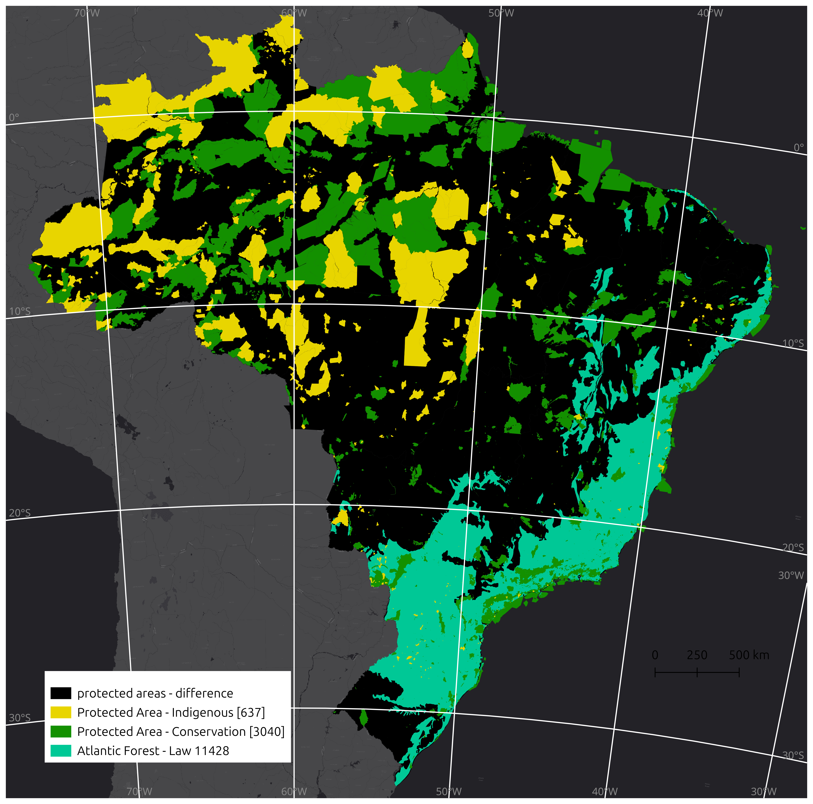
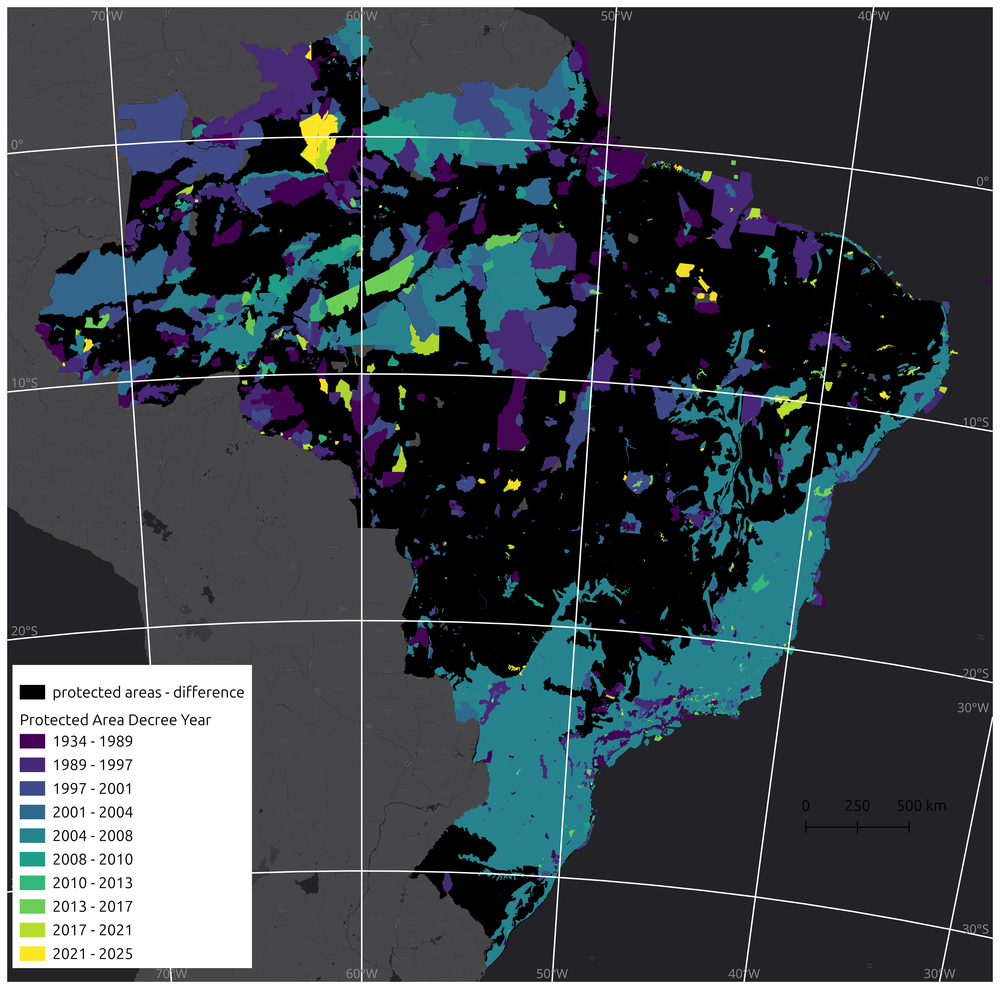
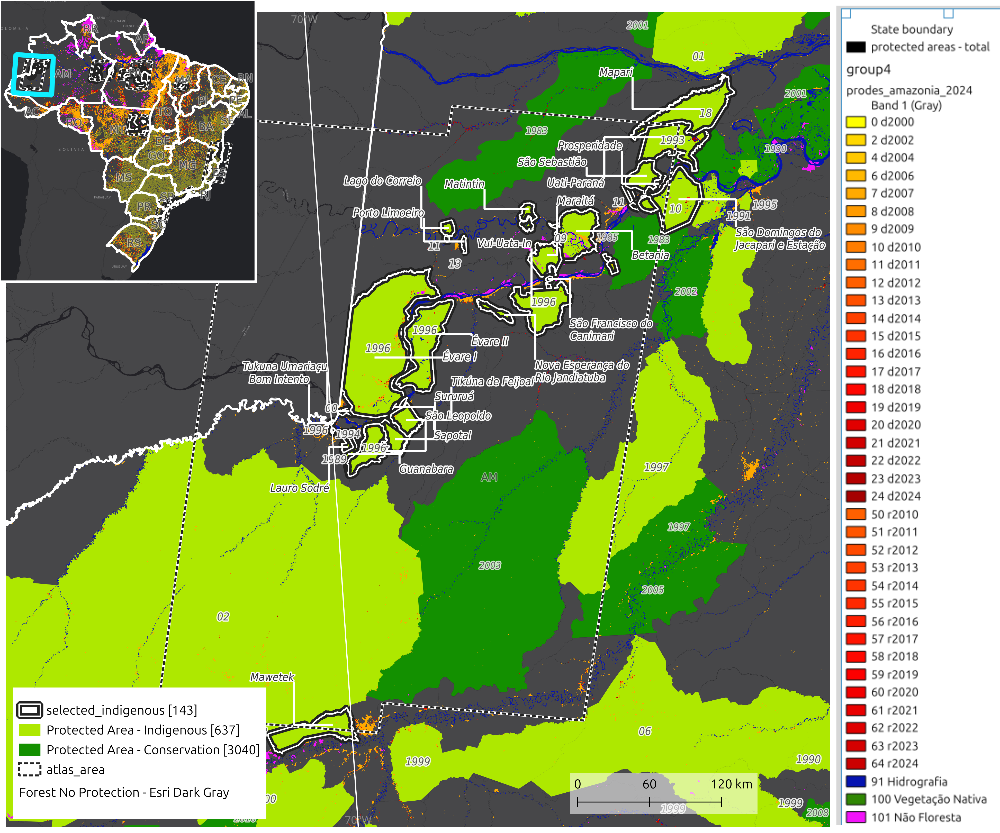

# Appendix A: Case Studies of Indigenous Reserves in Brazilian Tropical Forests

## Overview

This appendix provides detailed case studies examining land cover and use changes in Brazilian tropical forests over the past 50 years, with specific focus on indigenous reserves and environmental conservation units. These case studies complement the main dissertation by illustrating the spatial and temporal relationships between policy implementation and forest conservation outcomes.

## A.1 National Context: Protected Areas in Brazil

### A.1.1 Classification and Chronology of Protected Areas

*Figure A.1: Classification of protected territories in Brazil, including Indigenous Reserves, Environmental Conservation Areas (Sustainable Use and Protected), and Atlantic Forest areas protected by law.*

*Figure A.2: Chronological establishment of Indigenous Reserves and Environmental Conservation Areas, color-coded by creation date (lighter colors indicate more recent designations).*

### A.1.2 Historical Land Coverage in Protected Areas

*Figure A.3: Land cover classification within legally protected areas (indigenous reserves and environmental conservation units) according to MapBiomas collection 9 (2024), showing conditions in 1985.*

*Figure A.4: Land cover classification within legally protected areas (indigenous reserves and environmental conservation units) according to MapBiomas collection 9 (2024), showing conditions in 2023.*

### A.1.3 Historical Land Coverage in Non-Protected Areas

*Figure A.5: Land cover classification in areas without legal protection, outside indigenous reserves or environmental conservation units, according to MapBiomas collection 9 (2024), showing conditions in 1985.*

*Figure A.6: Land cover classification in areas without legal protection, outside indigenous reserves or environmental conservation units, according to MapBiomas collection 9 (2024), showing conditions in 2023.*

### A.1.4 Deforestation Patterns (2000-Present)

*Figure A.7: Accumulated official deforestation within protected areas according to PRODES 2023/2024 (INPE). Darker colors represent more recent deforestation; yellow (2000) includes accumulated estimates since the 1980s.*

*Figure A.8: Accumulated official deforestation in non-protected areas according to PRODES 2023/2024 (INPE). Darker colors represent more recent deforestation; yellow (2000) includes accumulated estimates since the 1980s.*

## A.2 Case Study Selection Methodology

Eight regions were selected for detailed case studies based on their geographical distribution, historical significance, and representation of different policy implementation timelines. These sites span three major Brazilian biomes and include areas with varying levels of anthropogenic pressure.

*Figure A.9: Geographic distribution of the eight selected case study regions within protected areas across Brazil.*

*Figure A.10: Geographic distribution of non-protected areas surrounding the selected case study regions.*

## A.3 Atlantic Forest Case Studies

### A.3.1 South Bahia and Espírito Santo (Atlantic Forest Case Study 1)

*Figure A.11: Overview of the Atlantic Forest Region 1, including South Bahia and Espírito Santo states.*

This region holds particular historical significance as the site of initial Portuguese colonization in Brazil (1500s). It contains:

*Figure A.12: Barra Velha do Monte Pascoal Indigenous Reserve (Bahia), homeland of Tupiniquim indigenous peoples.*

*Figure A.13: Tupiniquim Indigenous Reserve (Espírito Santo).*

### A.3.2 São Paulo Coast (Atlantic Forest Case Study 2)

*Figure A.14: Overview of Atlantic Forest Region 2, covering the São Paulo coastal area.*

This region is adjacent to Brazil's largest urban centers and earliest European settlements:

*Figure A.15: Piaçaguera Indigenous Reserve (São Paulo), homeland of Guarani indigenous peoples.*

### A.3.3 Southern São Paulo and Northern Paraná Coast (Atlantic Forest Case Study 3)

*Figure A.16: Overview of Atlantic Forest Region 3, covering southern São Paulo and northern Paraná coastal areas.*

This region contains larger protected areas with significant Guarani populations:

*Figure A.17: Cerco Grande Indigenous Reserve (Paraná), homeland of Guarani indigenous peoples.*

## A.4 Amazon-Cerrado Transition Case Studies

### A.4.1 Maranhão (Amazon Case Study 1)

*Figure A.18: Overview of Amazon Region 1 in Maranhão state.*

This region illustrates policy evolution from the 1980s to present:

*Figure A.19: Bacurizinho Indigenous Reserve (Maranhão), established in the 1980s with recent expansion studies (2020s) and new adjacent reserves created in 2023-2024.*

### A.4.2 Mato Grosso (Amazon Case Study 2)

*Figure A.20: Overview of Amazon Region 2 in Mato Grosso state.*

This region contains Brazil's first indigenous reserve:

*Figure A.21: Parque do Xingu (Mato Grosso/Pará), created in 1987 and home to fifteen indigenous ethnicities: Wauja, Trumái, Yawalapití, Mehináku, Aweti, Yudjá, Kisêdjê, Ikpeng, Matipú, Kuikuro, Nahukuá, Tapayuna, Kaiabi, Kamayrurá, and Kalapalo.*

## A.5 Amazon Interior Case Studies

### A.5.1 Eastern Pará (Amazon Case Study 3)

*Figure A.22: Overview of Amazon Region 3 in eastern Pará state.*

This region demonstrates contrasting conservation outcomes between reserves established in different periods:

*Figure A.23: Arara Indigenous Reserve (Pará), showing better conservation in reserves established in the late 1990s compared to those established in the late 2000s. Home to Araweté, Asurini do Xingu, Kayapó and Arara do Pará indigenous peoples.*

### A.5.2 Central Amazon (Amazon Case Study 4)

*Figure A.24: Overview of Amazon Region 4 in the central Amazon region.*

This region includes larger peripheral reserves with varied deforestation patterns:

*Figure A.25: Gavião Indigenous Reserve (Amazonas), established between 1987 and 2004, home to Sateré-Mawé and Mundurukú indigenous peoples. Smaller reserves of Múra indigenous peoples are located near the Amazon River and Manaus, the largest city in the Amazon biome.*

### A.5.3 Western Amazon (Amazon Case Study 5)

*Figure A.26: Overview of Amazon Region 5 in the western Amazon region.*

This remote region shows particular deforestation patterns along waterways:

*Figure A.27: Betania Indigenous Reserve (Amazonas), showing deforestation patterns concentrated near rivers and distributed both inside and outside reserves. Home to Tikúna and Kokama indigenous peoples.*

---

*Note: All maps and spatial analyses were produced as part of this doctoral research using data from INPE, MapBiomas Collection 9 (2024), and the Brazilian government's indigenous and environmental databases. Creation dates for protected areas are derived from presidential decrees and environmental legislation.*