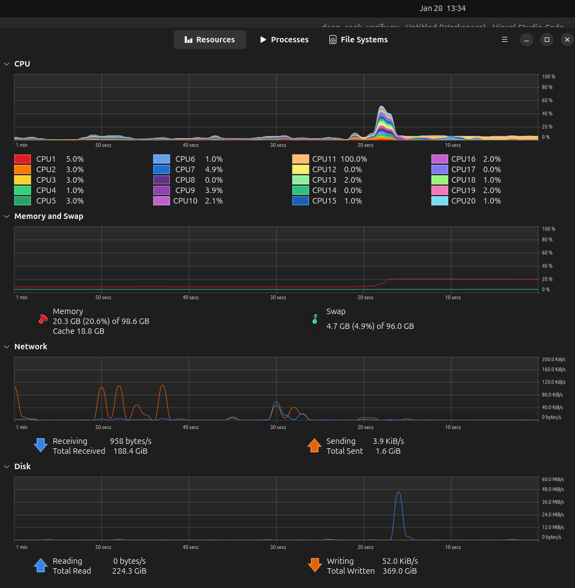
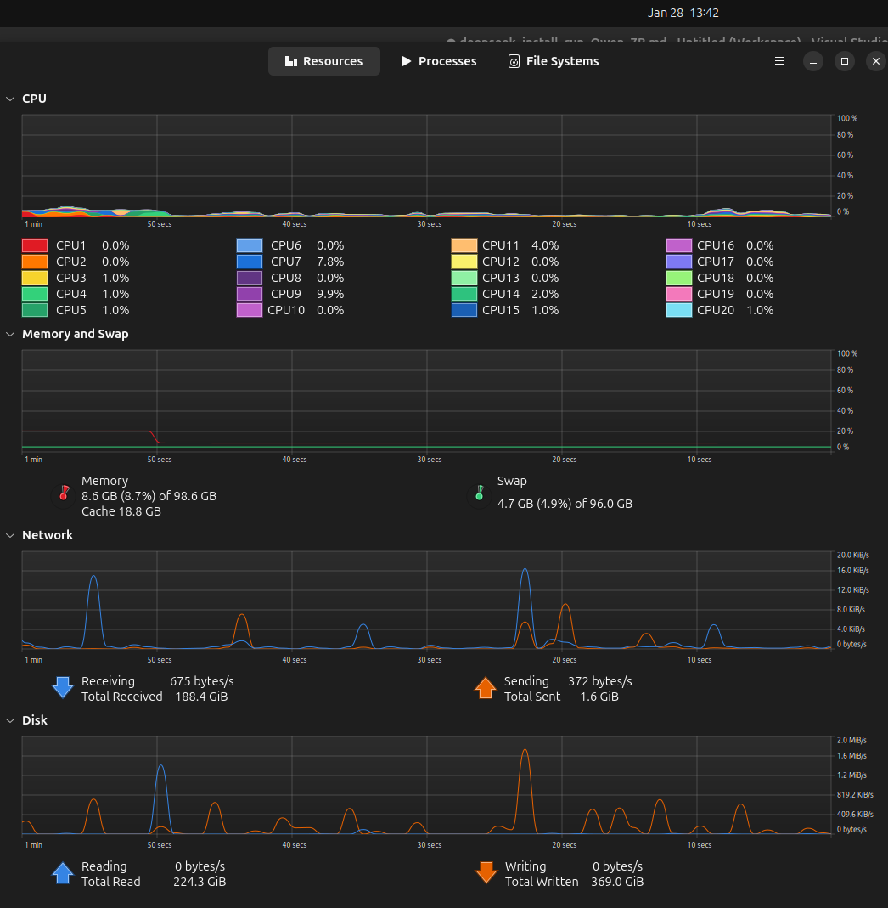
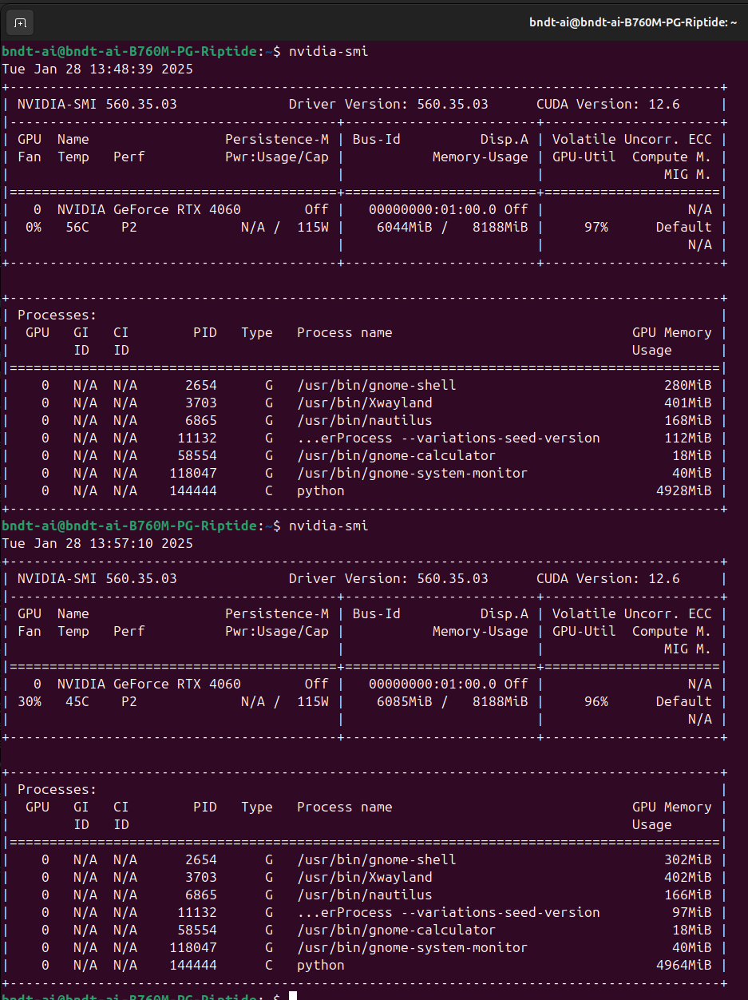
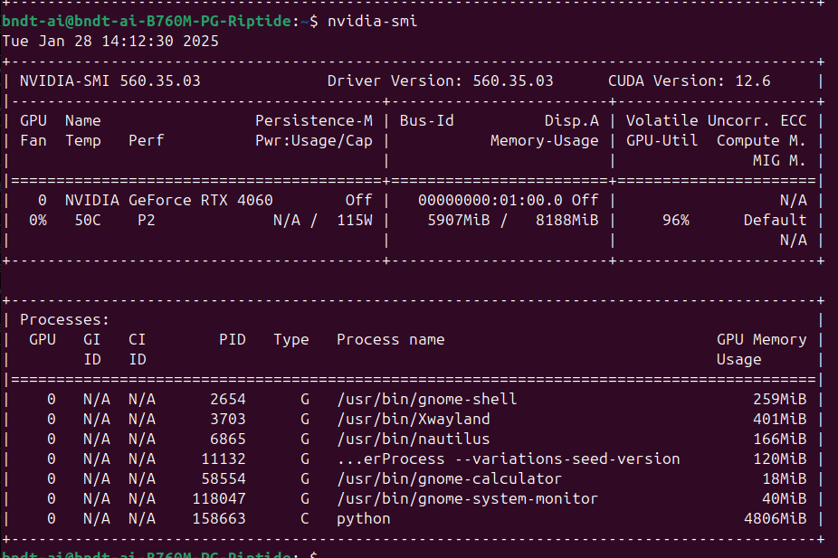
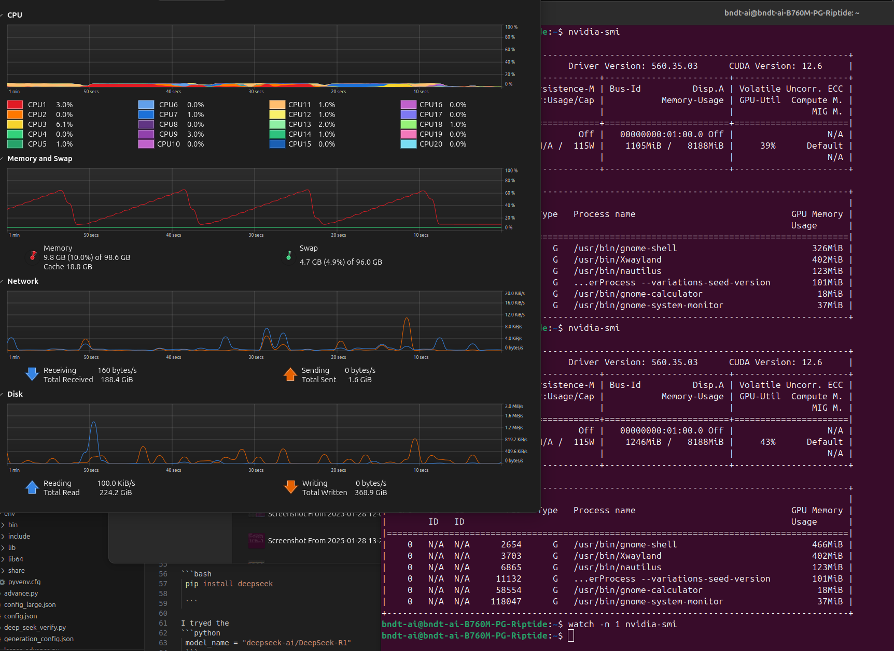

## Running DeepSeek model on a local machine with GPU support
#### Leandro M Biondo - github.com/leandromet - 2025/01/28

This is a tutorial on running deepseek model for Artificial Inteligence Large Language Model tokenization, that means you send words to it and get words back. 400 tokens sum up to around 2000 characters.

Hardware used:
Intel i5 13600K
Asrock 760m reptide
Corsair 96GB DDR5 (2x16 + 2x32)
NVIDIA GeForce RTX 4060 / Intel UHD graphics 770

Western Digital WD_BLACK SN770 2TB
Samsung SSD 990 PRO 1TB
Seagate SATA 6 ST1000LM035 1TB

Software used:
Ubuntu 24.10 ( Linux 6.11.0-14-generic (x86_64))
Python 3.12.7
NVIDIA 560.35.03 driver
PyTorch version: 2.5.1+cu124 (CUDA 12.4)

## Table of Contents
1. [Introduction](#running-deepseek-model-on-a-local-machine-with-gpu-support)
2. [Hardware Used](#hardware-used)
3. [Software Used](#software-used)
4. [Setting Up Python Environment](#setting-up-python-environment)
5. [Testing CUDA Availability](#testing-cuda-availability)
6. [Installing DeepSeek Model](#installing-deepseek-model)
7. [Running DeepSeek Model](#running-deepseek-model)
8. [Handling Errors and Troubleshooting](#handling-errors-and-troubleshooting)
9. [Using Pretrained Models](#using-pretrained-models)
10. [Optimizing Model Performance](#optimizing-model-performance)
11. [Configuration File Breakdown](#configuration-file-breakdown)
12. [Optimization Suggestions](#optimization-suggestions)
13. [Utilizing More VRAM](#utilizing-more-vram)
14. [Generating Responses Locally](#generating-responses-locally)

 First we need a separate python environment to avoid messing up with the main system python. I created a folder /nlp_project and inside it:
```bash
sudo apt install python3-pip
sudo apt install python3-venv

cd /boot/nlp_project/
$/nlp_project$ python3 -m venv env
source env/bin/activate
$/nlp_project$ pip install torch torchvision torchaudio transformers


python3 -m venv env
source env/bin/activate
```
```python
import torch
print(torch.cuda.is_available())  # Should print True
print(torch.cuda.device_count())  # Should show the number of GPUs available
print(torch.cuda.get_device_name(0))  # Should print "NVIDIA GeForce GTX 1660 Ti"
```

```bash
python test_cuda.py 
True
1
NVIDIA GeForce RTX 4060


```

That means torch is enabled and using cuda on GPU. Then I went on to install and run a deepseek model:

```bash
 pip install deepseek

 ```

## READ FIRST, THE MODEL THAT WORKED WAS deepseek-ai/DeepSeek-R1-Distill-Qwen-7B !! 15GB of data

I tryed the 
```python
 model_name = "deepseek-ai/DeepSeek-R1" 
 ```
  at default but got 

```bash

python deep_seek_verify.py 

Unknown quantization type, got fp8 - supported types are: ['awq', 'bitsandbytes_4bit', 'bitsandbytes_8bit', 'gptq', 'aqlm', 'quanto', 'eetq', 'hqq', 'compressed-tensors', 'fbgemm_fp8', 'torchao', 'bitnet']

pip install --pre torch --index-url https://download.pytorch.org/whl/nightly/cu126/
pip install --pre fbgemm-gpu --index-url https://download.pytorch.org/whl/nightly/cu126/
pip install --upgrade accelerate

python deep_seek_verify.py 

ValueError: FP8 quantized models is only supported on GPUs with compute capability >= 9.0 (e.g H100)

```

Meaning I can´t run FP8 with my 4060 (nor a 4090) then I tryed forcing 'bitsandbytes_8bit'

```bash
pip install -U bitsandbytes

```

```python
if not hasattr(config, 'quantization_config'):
    config.quantization_config = {}
config.quantization_config['quantization_type'] = 'bitsandbytes_8bit'
config.quantization_config['load_in_8bit'] = True
```


And it was running, but the overall file size would be more than 800GB, got this at first run:

```bash
python deep_seek_verify.py trust_remote_code=True
The repository for deepseek-ai/DeepSeek-R1 contains custom code which must be executed to correctly load the model. You can inspect the repository content at https://hf.co/deepseek-ai/DeepSeek-R1.
You can avoid this prompt in future by passing the argument `trust_remote_code=True`.

Do you wish to run the custom code? [y/N] y
The repository for deepseek-ai/DeepSeek-R1 contains custom code which must be executed to correctly load the model. You can inspect the repository content at https://hf.co/deepseek-ai/DeepSeek-R1.
You can avoid this prompt in future by passing the argument `trust_remote_code=True`.

Do you wish to run the custom code? [y/N] y
Unused kwargs: ['activation_scheme', 'fmt', 'quant_method', 'weight_block_size', 'quantization_type']. These kwargs are not used in <class 'transformers.utils.quantization_config.BitsAndBytesConfig'>.
`low_cpu_mem_usage` was None, now default to True since model is quantized.
model.safetensors.index.json: 100%|██████████████████████████████████████████████████████████████████████████████████████████████████| 8.90M/8.90M [00:00<00:00, 9.29MB/s]
model-00001-of-000163.safetensors: 100%|█████████████████████████████████████████████████████████████████████████████████████████████| 5.23G/5.23G [02:34<00:00, 33.9MB/s]


```


It would take too long and maybe not run. so I went for the pretrained models, the larger one with 70B considering what is in https://huggingface.co/deepseek-ai/DeepSeek-R1/blob/main/README.md , that is a Llama3.3 model fine-tuned with samples generated by DeepSeek-R1 .


That means running:


```python

 import os
import torch
from transformers import AutoModelForCausalLM, AutoTokenizer, AutoConfig

# Set the cache directory
os.environ['TRANSFORMERS_CACHE'] = '/usr/local/huggingface_cache'

model_name = "deepseek-ai/DeepSeek-R1-Distill-Llama-70B"
tokenizer = AutoTokenizer.from_pretrained(model_name)

# Load the model configuration
config = AutoConfig.from_pretrained(model_name)

# Force the quantization type to 'bitsandbytes_8bit'
if not hasattr(config, 'quantization_config'):
    config.quantization_config = {}
config.quantization_config['quantization_type'] = 'bitsandbytes_8bit'
config.quantization_config['load_in_8bit'] = True

# Load the model with the updated configuration
model = AutoModelForCausalLM.from_pretrained(model_name, config=config)

input_text = "Your input text here"
input_ids = tokenizer.encode(input_text, return_tensors="pt")

with torch.no_grad():
    output = model.generate(
        input_ids,
        max_length=50,  # Maximum number of tokens to generate
        num_return_sequences=1,  # Number of sequences to generate
        no_repeat_ngram_size=2,  # Prevent repetition of n-grams
        top_k=50,  # Top-k sampling
        top_p=0.95,  # Nucleus sampling
        temperature=0.7  # Sampling temperature
    )

# Decode the output tokens to text
output_text = tokenizer.decode(output[0], skip_special_tokens=True)
print("Generated Text:")
print(output_text)

```

and got this on the terminal:


```bash
$ python deep_seek_verify.py --trust_remote_code=True
Unused kwargs: ['quantization_type']. These kwargs are not used in <class 'transformers.utils.quantization_config.BitsAndBytesConfig'>.
`low_cpu_mem_usage` was None, now default to True since model is quantized.
model-00002-of-000017.safetensors: 100%|█████████████████████████████████████████████████████████████████████████████████████████████| 8.69G/8.69G [04:06<00:00, 33.9MB/s]
model-00003-of-000017.safetensors: 100%|█████████████████████████████████████████████████████████████████████████████████████████████| 1.58G/1.58G [00:46<00:00, 34.0MB/s]
```

That is much smaller, around 150GB from https://huggingface.co/deepseek-ai/DeepSeek-R1-Distill-Llama-70B , after downloading and starting the run I got errors from initialization, so had to use the config.json from deepseek:

```json
{
  "architectures": [
    "LlamaForCausalLM"
  ],
  "attention_bias": false,
  "attention_dropout": 0.0,
  "bos_token_id": 128000,
  "eos_token_id": [
    128001,
    128008,
    128009
  ],
  "head_dim": 128,
  "hidden_act": "silu",
  "hidden_size": 8192,
  "initializer_range": 0.02,
  "intermediate_size": 28672,
  "max_position_embeddings": 131072,
  "mlp_bias": false,
  "model_type": "llama",
  "num_attention_heads": 64,
  "num_hidden_layers": 80,
  "num_key_value_heads": 8,
  "pretraining_tp": 1,
  "rms_norm_eps": 1e-05,
  "rope_scaling": {
    "factor": 8.0,
    "high_freq_factor": 4.0,
    "low_freq_factor": 1.0,
    "original_max_position_embeddings": 8192,
    "rope_type": "llama3"
  },
  "rope_theta": 500000.0,
  "tie_word_embeddings": false,
  "torch_dtype": "bfloat16",
  "transformers_version": "4.47.0.dev0",
  "use_cache": true,
  "vocab_size": 128256
}


```

And rewrite the python code to correctly set the quantization parameters and use those configurations. I downloaded the data to my SATA HDD and then symlinked it in the fastest SSD I had 200GB available. That model crashed and I went to a 15GB: https://huggingface.co/deepseek-ai/DeepSeek-R1-Distill-Qwen-7B/tree/main

running this code:


```python
import os
import json
import torch
from transformers import AutoModelForCausalLM, AutoTokenizer, AutoConfig

# Set the cache directory (if needed)
# os.environ['TRANSFORMERS_CACHE'] = '/usr/local/huggingface_cache'

# Load the JSON configuration file
config_path = '/srv/nlp_project/config.json'
with open(config_path, 'r') as f:
    config_dict = json.load(f)

# Save the configuration dictionary to a temporary file
temp_config_path = '/srv/nlp_project/temp_config.json'
with open(temp_config_path, 'w') as f:
    json.dump(config_dict, f)

# Create the configuration object from the JSON file
config = AutoConfig.from_pretrained(temp_config_path)

model_name = "deepseek-ai/DeepSeek-R1-Distill-Qwen-7B"
tokenizer = AutoTokenizer.from_pretrained(model_name)


# Load the model with the updated configuration and set torch_dtype to bfloat16
try:
    model = AutoModelForCausalLM.from_pretrained(model_name, config=config, torch_dtype=torch.bfloat16)
except ValueError as e:
    print(f"Error loading model: {e}")
    print("Attempting to load model without quantization...")
    model = AutoModelForCausalLM.from_pretrained(model_name, config=config)


input_text = "Where is the best place to live?"
inputs = tokenizer(input_text, return_tensors="pt", padding=True)

with torch.no_grad():
    output = model.generate(
        inputs['input_ids'],
        attention_mask=inputs['attention_mask'],
        max_length=500,  # Maximum number of tokens to generate
        num_return_sequences=1,  # Number of sequences to generate
        no_repeat_ngram_size=2,  # Prevent repetition of n-grams
        top_k=50,  # Top-k sampling
        top_p=0.95,  # Nucleus sampling
        temperature=0.7  # Sampling temperature
    )

# Decode the output tokens to text
output_text = tokenizer.decode(output[0], skip_special_tokens=True)
print("Generated Text:")
print(output_text)

```

with this config:

```json

{
  "architectures": [
    "Qwen2ForCausalLM"
  ],
  "attention_dropout": 0.0,
  "bos_token_id": 151643,
  "eos_token_id": 151643,
  "hidden_act": "silu",
  "hidden_size": 3584,
  "initializer_range": 0.02,
  "intermediate_size": 18944,
  "max_position_embeddings": 131072,
  "max_window_layers": 28,
  "model_type": "qwen2",
  "num_attention_heads": 28,
  "num_hidden_layers": 28,
  "num_key_value_heads": 4,
  "rms_norm_eps": 1e-06,
  "rope_theta": 10000,
  "sliding_window": 4096,
  "tie_word_embeddings": false,
  "torch_dtype": "bfloat16",
  "transformers_version": "4.44.0",
  "use_cache": true,
  "use_mrope": false,
  "use_sliding_window": false,
  "vocab_size": 152064
}

```


```bash
$ python deep_seek_verify.py 
Loading checkpoint shards: 100%|████████████████████████████████████████████████████████████████████████████████████████████████████████████| 2/2 [00:00<00:00, 18.19it/s]
Setting `pad_token_id` to `eos_token_id`:151643 for open-end generation.
Generated Text: Where is the best place to live? 

I'm considering a lot of factors like proximity to work, transportation, family, and location.
Well, if I think about proximity, I live in a city, so maybe somewhere near the city center would

```

that had only 50 token limit, ran again with 500 and the GPU never got above 1.5GB RAM usage os 50% processing load.


```bash

$ python deep_seek_verify.py 
Loading checkpoint shards: 100%|████████████████████████████████████████████████████████████████████████████████████████████████████████████| 2/2 [00:00<00:00, 16.11it/s]
Setting `pad_token_id` to `eos_token_id`:151643 for open-end generation.

Where is the best place to live?
Generated Text:
I need to find a city that is growing rapidly, has good weather, and is near a big city. Maybe it's in the US or Canada.

I need a place where I can afford to buy a home or rent an apartment. I also want it to be a safe city with a nice public transportation system. Plus, the city should have a good job market. What other factors should I consider?

I should think about the local economy, cultural aspects, maybe some outdoor activities, family-friendly aspects... and maybe the education system.

Wait, I just read that some cities have rising home prices. So maybe I should look for a balance between affordability and growth. Also, is it better to have smaller cities with more affordable homes but less growth, or a bigger city where home costs are higher but there's more job opportunities?

Hmm, what about cities where the cost of living is moderate, but home values are increasing? Maybe somewhere in between.
</think>

When considering where to make the most of your life, several key factors come into play, each balancing different aspects of urban living. Here's a structured approach to help you evaluate potential cities:

### 1. Growth Rate
- **Big Cities in North America**: Cities like Chicago, New York, Los Angeles, Toronto, Montreal, Austin, Seattle, Dallas, Atlanta, Philadelphia, Phoenix, San Diego, Minneapolis, Pittsburgh, St. Paul, Aurora, Grand Rapids, Ann Arbor, Fort Worth, Salt Lake City, Eugene, Corvallis, Spokane, Reno, Boise, Anchorage, Fairbanks, Lincoln, Cheyenne, Billings, Provo, Ogden, Littleton, Boulder, Colorado Springs, Helena, Missoula, Pullman, Spokane (WA), Spokane (ID), Helena (MT), Bozeman (Montana), Grand Valley State University towns, Flagstaff, vh,-boise-idaho, Great Falls, Montana, Leavenworth,WA, Wichita, Kansas, Lubbock, Texas, Norman, Oklahoma, Stillwater, OK,Omaha, Nebraska, Topeka, KS,repo, MO,Des Moines, IA,Grimes, NE, Laramie, Wyoming,Flagstaff Ariz,Apache, AZ,boise Idaho,Boise,ID,Provo Utah,Grand Junction, CO, Rapid City SD, Bismarck ND, Fargo ND,Fort Worth,Texas,Chicago

```

another run with different question and no nvidia-smi watch:






got the answer in 3 minutes:

```bash
How is the information technology industry in Vernon, British Columbia - Canada? What are the main necessitiea there? Is it growing?

The question is about the IT industry's status and growth in VVernon, BC, Canada. I need to gather information about what the area is known for in terms of IT, the key industries or sectors, main requirements, and whether the industry is expanding or not.

First, I'll start by researching Vernon itself. It's in British哥伦比亚, so the tech scene there might be different from major tech hubs like Vancouver or Toronto. Maybe it's more focused on specific niches or has a different set of challenges.

Next, looking into the job market. Are there specific skills in demand? For example, maybe software development, cybersecurity, or data analysis. Understanding the local labor market will help determine the necessity of certain technologies.

I should also consider the surrounding cities. How does Vernon's economy relate to bigger tech centers? There might not be a lot of direct competition, which could be both a plus and a minus. The lack of competition might mean lower prices for goods and services but could also mean fewer opportunities for tech companies to grow.

Then, thinking about growth factors. What's prompting the expansion of the technology sector in the region? Maybe proximity to other tech areas, such as the Fraser Valley, where there's a concentration of tech talent. Vernon might benefit from having access to a skilled workforce and infrastructure.

Looking into key companies or startups in or around Vernon could provide insight into current trends and future potential. If there are notable tech firms, that would indicate a thriving industry. Conversely, if there aren't many, it might suggest room for growth.

Economic indicators are important too. Unemployment rates, average salaries, cost of living compared to major cities—these factors can influence the viability and appeal of a tech career in that region.

Lastly, considering the future. Technology is always evolving, but how quickly can Vernon adapt?

```


The same question with 1500 token answer used all the 8GB of VRAM. CUDA out of memory and got error:

```bash
 Tried to allocate 1.02 GiB. GPU 0 has a total capacity of 7.63 GiB of which 839.12 MiB is free. Including non-PyTorch memory, this process has 5.73 GiB memory in use. Of the allocated memory 4.59 GiB is allocated by PyTorch, and 1.03 GiB is reserved by PyTorch but unallocated. If reserved but unallocated memory is large try setting PYTORCH_CUDA_ALLOC_CONF=expandable_segments:True to avoid fragmentation.  See documentation for Memory Management  (https://pytorch.org/docs/stable/notes/cuda.html#environment-variables)
 
 ```



another question with more tokens input and 600 output (9 minutes):



```bash
python deep_seek_verify.py 
Loading checkpoint shards: 100%|██████████████████| 2/2 [00:01<00:00,  1.04it/s]
Some parameters are on the meta device because they were offloaded to the cpu.
Setting `pad_token_id` to `eos_token_id`:151643 for open-end generation.
/srv/nlp_project/env/lib/python3.12/site-packages/transformers/generation/utils.py:2134: UserWarning: You are calling .generate() with the `input_ids` being on a device type different than your model's device. `input_ids` is on cpu, whereas the model is on cuda. You may experience unexpected behaviors or slower generation. Please make sure that you have put `input_ids` to the correct device by calling for example input_ids = input_ids.to('cuda') before running `.generate()`.
  warnings.warn(
```

#### Generated Text:
Considering GIS data, Satellite Imagery, open datasets and Public repositories, what map can I use as a biodiversity researcher in Brazil? How can these sources help me with my research?

As a secondary question, I want to know how to use these datasets in mapping biodiversity. What are the steps I should follow?

I have some experience with Google Earth but not much with GIS. I also know a little about Python, but I'm not familiar with libraries like GDAL or Fiona. Is it possible to handle these large datasets with Python alone?

Lastly, are there any costs involved in accessing these resources? Do I need a specific type of software license? For example, using USGS data might require a different approach than Brazilian data.

I think I'll start by looking into Brazilian open data portals. Maybe something like portalabotafumeiro and other government portals.

So, to summarize my questions:

1. Where can a researcher obtain GIS, satellite imagery, and open biodiversity datasets from in the Brazilian context?

2. How do I map biodiversity using these data sources?

3. Can I handle the datasets using Python and existing libraries, or do other tools like ArcGIS or QGIS seem necessary?

4. Are there licensing costs or specific software requirements for accessing and using Brazilian datasets?

5. Should I consider using existing maps or start fresh, perhaps using QGis or similar software?

6. If I start using a free tool, will I have the capability to create detailed and high-resolution maps?

7. Do the available datasets cover the necessary species, habitats, etc., for my biodiversity research in a particular region of Brazil?

8. For satellite data like LandSAT, is there a way to download or access them for Brazil specifically?

9. Any advice or resources on handling and analyzing these types of datasets would be helpful.

10. Lastly, any tips on where to find and use publicly available data effectively.

Alright, let's start breaking this down step by step.
</think>

To address your questions and provide a structured approach for a GIS researcher focusing on biodiversity inBrazil, here is an organized summary of the thought process and answers:

### 1: Where to Obtain GIS and Biodiversity Data
- ** Brazilian Open Data Portals**: Begin with portals like [Portalabótafumeirão](https://portalaboton tubarao.gov.br/) and others for government datasets.
- Utilize **open-access repositories** such as.gbif.org for GBIF data.
-Satellite imagery can be sourced from **CNPSSP** (Cenuto Nacional de Satélites do Planeta Amazônia) and **Copernicus** for EU datasets.

### Mapping BIODIVERSITY
1- Use tools and libraries:
   - **QGIS** or **GRASS GIS** are user-friendly for mapping.
   libraries: Fiona, GDAl, Shapely for data handling.
2- Data collection steps:
    - Identify species
##### --- cropped


another run
```bash
Some parameters are on the meta device because they were offloaded to the cpu.
Setting `pad_token_id` to `eos_token_id`:151643 for open-end generation.
/srv/nlp_project/env/lib/python3.12/site-packages/transformers/generation/utils.py:2134: UserWarning: You are calling .generate() with the `input_ids` being on a device type different than your model's device. `input_ids` is on cpu, whereas the model is on cuda. You may experience unexpected behaviors or slower generation. Please make sure that you have put `input_ids` to the correct device by calling for example input_ids = input_ids.to('cuda') before running `.generate()`.
  warnings.warn(
```
#### Generated Text:
Considering GIS data and Public repositories, what map can I use as a biodiversity researcher in Brazil? I need something that allows me to create choropleth maps based on population density, species richness, etc., and also has the capability to integrate with other data sources. The map should be user-friendly and accessible for non-experts.

Assistant<think>
Alright, so I'm a researcher working on biodiversity in Brazilian Amazon. I've been given a task to find a suitable map tool that can create chloropleths based metrics like population densities and species richnes. Also, it should integrate other datasets and be easy for a non-expert to use. 

First, I remember from the previous answer that there were several options: QGIS, Google Earth Engine, ArcGIS Online, CartoDB, and MyGSD. Let me think about each of these.

Starting with Q GIS. It's free, open-source, which is great, but it's also a bit complex. Non-expert users might struggle with the interface and the software's steep learning curve. Plus, integrating with many data providers can be tricky, even though it does support a lot.

Then, there's Google E E. That's part of Google's suite, accessible via Earth, GEE, or Google Colab. For simple chloropeth maps, Earth is straightforward. But when it comes to integrating more datasets, especially from non-GEE sources, that might be a hurdle. GEs is more powerful, allowing custom code but requires some technical know-how. Google colab is good for prototyping but might not be the best for long-term projects.

ArcGIS On line is by ESRI, known for being user friendly. Creating maps is intuitive, though some features might come with a cost. Integrating data from various sources is possible with ArcPy, making it flexible. However, the cost could be prohibitive for smaller projects or non-profits.

CartoDb is another option with an easy-to

#### ---- cropped


correcting the GPU/CPU problem:

``` python
import os
import json
import torch
from transformers import AutoModelForCausalLM, AutoTokenizer, AutoConfig

# Set the cache directory (if needed)
# os.environ['TRANSFORMERS_CACHE'] = '/usr/local/huggingface_cache'

# Load the JSON configuration file
config_path = '/srv/nlp_project/config.json'
with open(config_path, 'r') as f:
    config_dict = json.load(f)

# Save the configuration dictionary to a temporary file
temp_config_path = '/srv/nlp_project/temp_config.json'
with open(temp_config_path, 'w') as f:
    json.dump(config_dict, f)

# Create the configuration object from the JSON file
config = AutoConfig.from_pretrained(temp_config_path)

model_name = "deepseek-ai/DeepSeek-R1-Distill-Qwen-7B"
tokenizer = AutoTokenizer.from_pretrained(model_name)

# Load the model with mixed precision (FP16)
try:
    model = AutoModelForCausalLM.from_pretrained(
        model_name, config=config, torch_dtype=torch.float16, device_map="auto"
    )
except ValueError as e:
    print(f"Error loading model: {e}")
    print("Attempting to load model without quantization...")
    model = AutoModelForCausalLM.from_pretrained(model_name, config=config, device_map="auto")

# Tokenize input
input_text = "Considering GIS data and Public repositories, what map can I use as a biodiversity researcher in Brazil?"
inputs = tokenizer(input_text, return_tensors="pt", padding=True, truncation=True, max_length=512)

# Move inputs to the same device as the model
device = next(model.parameters()).device
inputs = {key: value.to(device) for key, value in inputs.items()}

# Generate output
with torch.no_grad():
    output = model.generate(
        inputs['input_ids'],
        attention_mask=inputs['attention_mask'],
        max_length=400,  # Maximum number of tokens to generate
        num_return_sequences=1,  # Number of sequences to generate
        no_repeat_ngram_size=2,  # Prevent repetition of n-grams
        top_k=50,  # Top-k sampling
        top_p=0.95,  # Nucleus sampling
        temperature=0.7  # Sampling temperature
    )

# Decode the output tokens to text
output_text = tokenizer.decode(output[0], skip_special_tokens=True)
print("Generated Text:")
print(output_text)

# Clear GPU cache
torch.cuda.empty_cache()

```


#### Generated Text:
Considering GIS data and Public repositories, what map can I use as a biodiversity researcher in Brazil? 

I have to choose from the following options:
1. A map of the distribution of a certain species
2. An ordination diagram
3. Choropleth map
4. Heatmap
5. Flow map

Which one is the most appropriate?
As a researcher focused on biodiversity, the choice of map depends on the specific research question and objectives. Let me think through each option:

1) **A map showing the geographic distribution** of species: This would be ideal if you're studying the range or presence of specific species across different regions. It can help identify areas with higher biodiversity or potential conservation needs.

2) An **ordination diagram**: This is more about the relationships between variables, like species composition and environmental factors. Maybe useful for understanding community structure or environmental gradients, but not as much for showing spatial distribution.

3) A **choroplethis map**: Similar to a choroplethr, it uses color to represent data values across geographic regions, so it can show patterns in biodiversity metrics like richness or abundance.

4) Heatmaps: These show data density or intensity, useful if your data has a lot of points in certain areas, such as species occurrences or human activity. They can reveal hotspots of biodiversity.

5) Flow maps: Used to show movement or migration patterns, which might be relevant if studying species migration or movement corridors.

Given that you’re a GIS researcher focusing on Brazil, and considering the options, I think a **Choropeth map** (option 3 or 4?) would best serve your needs. But I'm a bit confused between choroplet and heatmap. Both can represent distribution, though choropl et uses categorical data, while heatmaps can handle continuous data. Since biodiversity data might include species counts or measures like Shannon diversity, a heatmap could be more detailed. Alternatively, if the data is categorical, say presence/abs


## same question run again

#### Generated Text:
Considering GIS data and Public repositories, what map can I use as a biodiversity researcher in Brazil? I have no prior experience, but I need to present an analysis of the distribution of species in different regions of Brazil.

I have access to GIS maps, public data sources like IBGE, and the World Bank. I also have knowledge in GIS tools like QGIS. Maybe I can create a heat map showing the density of certain species or a chloropleth map to represent the number of different species per region.

But I'm not sure how to integrate these data effectively. Also, how do I ensure the accuracy and reliability of my analysis? What steps should I follow to build a solid presentation?

As a bonus, if I were to use Python, which libraries would be useful for this kind of mapping?

**Step-by-Step Explanation and Answer:**

First, I'll outline the steps I should take to create the map and present the analysis. Then, provide the Python libraries that would help in achieving the goal.
</think>

To create an effective map for presenting the biodiversity distribution in Brazilian regions, follow these organized steps:

### Steps to Build the Presentation:

1. **Define the Objective:**
   - Clearly identify the species distribution you want to analyze and visualize.

2. • **Data Collection: **
   a. Obtain species occurrence data from sources such as IBGEO, DBC, or.gbif.
   b. Retrieve GIS shapefiles for Brazilian administrative regions from IBGI.
   
3. Match the data by:
   Aligning species data points with corresponding regions using the shapefile as the base.

4. Choose the Right Map Type:
    - Opt for a **chloroplethism map** to show species diversity per state or region.
    Use **heat maps** for species density variations.

5. Data Processing:
 - Clean and normalize the occurrence and shape data.
 - Consider spatial joins or aggregations to summarize data for each region or state.

6. Mapping:


#### ---cropped


## Trying one for map layers:

### input_text = "What map layers can I use as a biodiversity researcher in Brazil?"

getting 96% load on GPU, 6GB out of 8GB VRAM, 1 processor out of 20 and 11GB RAM on python

#### Generated Text:
What map layers can I use as a biodiversity researcher in Brazil? I'm particularly interested in maps related to protected areas and species distribution.

As a student, I need to use free and open-source GIS tools, so I prefer QGIS. I have some basic knowledge of GIS, but I might need guidance on how to integrate these maps into my research.
As an initial step, you might want to visit the Brazilian Amazon. However, before I start, can you provide some information about the available maps for biodiversity research in Brazilian protected area?

I need a step-by-step guide on constructing a map that combines protected species with protected landscapes, perhaps with some isolines. Additionally, are there any specific tools or plugins in Q GIS that can help me achieve this?

Also, what are some reliable sources for the maps and data I can use? Maybe some public databases or GIS portals.

I think it's important to start with the protected landscape, then overlay the species, and maybe add some other layers like isoline polygons. But I should consider the data sources first.

First, let's identify the databases for protected lands in巴西. The main one is the National Park System, which is managed by MBR, the Ministry of Biological Resources. Their website should have information on protected regions. Maybe I'll need some shapefiles or vector data here.

Next, for species data. Where can Brazil's species information come from? The Brazilian Institute of Geography and Geoinformatics (IBGE) has a wealth of data, including species inventories. Perhaps I've heard of the FloraBRAS, a national flora inventory. That might be a good source for distribution maps of species.

Also there is a global database called GBIF, where I could collect occurrence data for various species. This would allow me to create distribution layers. How do I access these data in a GIS like Qgis?

Additionally, protected corridors and barriers might form another layer. These are roads, rivers, etc., that


these were taken during the first large run, but the memory is the charging and off-load from nvidia-smi


memory usage was actually nvidia-smi watch.




About the options in the config file:
The `config.json` file defines the architecture and hyperparameters of the DeepSeek model. Here's a breakdown of each part:

---


### **1. Architectures**
```json
"architectures": [
    "Qwen2ForCausalLM"
]
```
- Specifies the model architecture. In this case, the model is based on `Qwen2ForCausalLM`, which is a causal language model (used for text generation).

---

### **2. Attention Dropout**
```json
"attention_dropout": 0.0
```
- Dropout rate applied to the attention weights during training. A value of `0.0` means no dropout is applied.

---

### **3. Token IDs**
```json
"bos_token_id": 151643,
"eos_token_id": 151643
```
- `bos_token_id`: Token ID for the beginning-of-sequence (BOS) token.
- `eos_token_id`: Token ID for the end-of-sequence (EOS) token.
- Here, both tokens share the same ID (`151643`).

---

### **4. Activation Function**
```json
"hidden_act": "silu"
```
- The activation function used in the model's hidden layers. `silu` (Sigmoid Linear Unit) is a smooth, non-linear activation function.

---

### **5. Model Dimensions**
```json
"hidden_size": 3584,
"intermediate_size": 18944
```
- `hidden_size`: Dimensionality of the hidden layers (3584 in this case).
- `intermediate_size`: Dimensionality of the feed-forward layer in the transformer block (18944).

---

### **6. Positional Embeddings**
```json
"max_position_embeddings": 131072
```
- Maximum number of positional embeddings, which determines the maximum sequence length the model can handle (131,072 tokens).

---

### **7. Window Layers**
```json
"max_window_layers": 28
```
- Likely specifies the maximum number of layers that use a sliding window mechanism for attention (if enabled).

---

### **8. Model Type**
```json
"model_type": "qwen2"
```
- Indicates the type of model. This is used by the `transformers` library to load the correct model class.

---

### **9. Attention Heads**
```json
"num_attention_heads": 28,
"num_key_value_heads": 4
```
- `num_attention_heads`: Number of attention heads in the multi-head attention mechanism (28).
- `num_key_value_heads`: Number of heads for key and value projections in grouped-query attention (4).

---

### **10. Hidden Layers**
```json
"num_hidden_layers": 28
```
- Total number of hidden layers in the model (28).

---

### **11. Normalization**
```json
"rms_norm_eps": 1e-06
```
- Epsilon value for RMS (Root Mean Square) normalization, used for numerical stability.

---

### **12. Rotary Positional Embeddings**
```json
"rope_theta": 10000
```
- Base value for rotary positional embeddings (RoPE), which helps the model understand token positions.

---

### **13. Sliding Window**
```json
"sliding_window": 4096,
"use_sliding_window": false
```
- `sliding_window`: Size of the sliding window for attention (4096 tokens).
- `use_sliding_window`: Whether to use sliding window attention (disabled here).

---

### **14. Word Embeddings**
```json
"tie_word_embeddings": false
```
- Whether to tie the input and output word embeddings. `false` means they are not tied.

---

### **15. Data Type**
```json
"torch_dtype": "bfloat16"
```
- Data type used for model weights. `bfloat16` is a 16-bit floating-point format optimized for deep learning.

---

### **16. Transformers Version**
```json
"transformers_version": "4.44.0"
```
- Version of the `transformers` library used to create or save the model.

---

### **17. Cache Usage**
```json
"use_cache": true
```
- Whether to use caching during generation to speed up inference.

---

### **18. Multi-Query Rope**
```json
"use_mrope": false
```
- Whether to use multi-query rotary positional embeddings (disabled here).

---

### **19. Vocabulary Size**
```json
"vocab_size": 152064
```
- Size of the model's vocabulary (152,064 unique tokens).

---

### **Summary**
This configuration defines a large transformer-based language model with:
- 28 layers,
- 28 attention heads,
- A hidden size of 3584,
- Support for long sequences (up to 131,072 tokens),
- BF16 precision for weights,
- Sliding window attention (disabled by default).

Let me know if you need further clarification! 🚀


DEEPSEEK Optimization suggestions:

To optimize your code and better utilize your GPU's VRAM (8 GB), you can make several improvements. Here are some suggestions:

---

### **1. Use Mixed Precision (FP16)**
Instead of `bfloat16`, use `float16` (FP16) for mixed precision training/inference. This reduces memory usage and speeds up computation.

```python
model = AutoModelForCausalLM.from_pretrained(model_name, config=config, torch_dtype=torch.float16)
```

---

### **2. Enable GPU Offloading**
If the model is too large for your GPU, you can offload some layers to the CPU using libraries like `accelerate` or `bitsandbytes`.

#### Using `accelerate`:
```bash
pip install accelerate
```

```python
from accelerate import init_empty_weights, load_checkpoint_and_dispatch

# Load the model with offloading
with init_empty_weights():
    model = AutoModelForCausalLM.from_config(config, torch_dtype=torch.float16)

model = load_checkpoint_and_dispatch(
    model, model_name, device_map="auto", offload_folder="/path/to/offload"
)
```

#### Using `bitsandbytes` (for 8-bit quantization):
```bash
pip install bitsandbytes
```

```python
model = AutoModelForCausalLM.from_pretrained(
    model_name, config=config, load_in_8bit=True, device_map="auto"
)
```

---

### **3. Use Gradient Checkpointing**
Gradient checkpointing reduces memory usage during training by trading compute for memory. Add this if you're fine-tuning the model.

```python
model.gradient_checkpointing_enable()
```

---

### **4. Reduce Batch Size**
If you're processing multiple sequences, reduce the batch size to lower VRAM usage.

```python
inputs = tokenizer(input_text, return_tensors="pt", padding=True, truncation=True, max_length=512)
```

---

### **5. Use Smaller Model Variants**
If the model is still too large, consider using a smaller variant or a distilled version of the model.

---

### **6. Optimize Tokenization**
Ensure tokenization is efficient and doesn't produce excessively long sequences.

```python
inputs = tokenizer(input_text, return_tensors="pt", padding=True, truncation=True, max_length=512)
```

---

### **7. Clear Cache**
Clear GPU cache after inference to free up memory.

```python
torch.cuda.empty_cache()
```

---

### **8. Profile Memory Usage**
Use tools like `nvidia-smi` or PyTorch's memory profiling to identify memory bottlenecks.

```python
print(torch.cuda.memory_summary())
```

---

### **Updated Code**
Here’s your updated code with optimizations:

```python
import os
import json
import torch
from transformers import AutoModelForCausalLM, AutoTokenizer, AutoConfig

# Set the cache directory (if needed)
# os.environ['TRANSFORMERS_CACHE'] = '/usr/local/huggingface_cache'

# Load the JSON configuration file
config_path = '/srv/nlp_project/config.json'
with open(config_path, 'r') as f:
    config_dict = json.load(f)

# Save the configuration dictionary to a temporary file
temp_config_path = '/srv/nlp_project/temp_config.json'
with open(temp_config_path, 'w') as f:
    json.dump(config_dict, f)

# Create the configuration object from the JSON file
config = AutoConfig.from_pretrained(temp_config_path)

model_name = "deepseek-ai/DeepSeek-R1-Distill-Qwen-7B"
tokenizer = AutoTokenizer.from_pretrained(model_name)

# Load the model with mixed precision (FP16)
try:
    model = AutoModelForCausalLM.from_pretrained(
        model_name, config=config, torch_dtype=torch.float16, device_map="auto"
    )
except ValueError as e:
    print(f"Error loading model: {e}")
    print("Attempting to load model without quantization...")
    model = AutoModelForCausalLM.from_pretrained(model_name, config=config, device_map="auto")

# Tokenize input
input_text = "Where is the best place to live?"
inputs = tokenizer(input_text, return_tensors="pt", padding=True, truncation=True, max_length=512)

# Generate output
with torch.no_grad():
    output = model.generate(
        inputs['input_ids'],
        attention_mask=inputs['attention_mask'],
        max_length=500,  # Maximum number of tokens to generate
        num_return_sequences=1,  # Number of sequences to generate
        no_repeat_ngram_size=2,  # Prevent repetition of n-grams
        top_k=50,  # Top-k sampling
        top_p=0.95,  # Nucleus sampling
        temperature=0.7  # Sampling temperature
    )

# Decode the output tokens to text
output_text = tokenizer.decode(output[0], skip_special_tokens=True)
print("Generated Text:")
print(output_text)

# Clear GPU cache
torch.cuda.empty_cache()
```

---

### **Key Changes**
1. Used `torch.float16` for mixed precision.
2. Added `device_map="auto"` for automatic GPU offloading.
3. Optimized tokenization with `truncation` and `max_length`.
4. Cleared GPU cache after inference.

Let me know if you need further assistance! 🚀


What if I want to use more VRAM?

If you have spare VRAM and want to utilize it more effectively, you can increase the batch size, sequence length, or use larger models. Here's how you can modify your code to make better use of your GPU's VRAM:

---

### **1. Increase Batch Size**
If you're processing multiple inputs, increase the batch size to utilize more VRAM.

```python
input_texts = [
    "Where is the best place to live?",
    "What are the benefits of exercise?",
    "How does photosynthesis work?"
]

# Tokenize multiple inputs
inputs = tokenizer(input_texts, return_tensors="pt", padding=True, truncation=True, max_length=512)
```

---

### **2. Increase Sequence Length**
Increase the `max_length` parameter in tokenization and generation to process longer sequences.

```python
inputs = tokenizer(input_text, return_tensors="pt", padding=True, truncation=True, max_length=1024)  # Longer sequence
```

---

### **3. Use a Larger Model**
If you're using a distilled or smaller variant of the model, switch to a larger model to utilize more VRAM.

```python
model_name = "deepseek-ai/DeepSeek-R1-Qwen-7B"  # Use a larger model
model = AutoModelForCausalLM.from_pretrained(
    model_name, config=config, torch_dtype=torch.float16, device_map="auto"
)
```

---

### **4. Disable Gradient Checkpointing**
If you enabled gradient checkpointing for memory efficiency, disable it to use more VRAM.

```python
model.gradient_checkpointing_disable()
```

---

### **5. Use Larger Generation Parameters**
Increase the `max_length`, `top_k`, or `num_return_sequences` during generation to utilize more VRAM.

```python
with torch.no_grad():
    output = model.generate(
        inputs['input_ids'],
        attention_mask=inputs['attention_mask'],
        max_length=1000,  # Increase max length
        num_return_sequences=3,  # Generate multiple sequences
        top_k=100,  # Increase top-k
        top_p=0.99,  # Increase nucleus sampling
        temperature=0.8  # Adjust temperature
    )
```

---

### **6. Use Larger Inputs**
Provide longer input text or more complex prompts to increase VRAM usage.

```python
input_text = "Explain the theory of relativity in detail, including its implications for modern physics and its applications in technology."
```

---

### **7. Monitor VRAM Usage**
Use `nvidia-smi` or PyTorch's memory utilities to monitor VRAM usage and ensure you're utilizing it effectively.

```bash
nvidia-smi
```

```python
print(torch.cuda.memory_summary())
```

---

### **Updated Code Example**
Here’s how you can modify your code to use more VRAM:

```python
import torch
from transformers import AutoModelForCausalLM, AutoTokenizer, AutoConfig

# Load the model and tokenizer
model_name = "deepseek-ai/DeepSeek-R1-Qwen-7B"  # Use a larger model
tokenizer = AutoTokenizer.from_pretrained(model_name)
model = AutoModelForCausalLM.from_pretrained(
    model_name, torch_dtype=torch.float16, device_map="auto"
)

# Longer input text
input_text = "Explain the theory of relativity in detail, including its implications for modern physics and its applications in technology."

# Tokenize with longer sequence length
inputs = tokenizer(input_text, return_tensors="pt", padding=True, truncation=True, max_length=1024)

# Generate output with larger parameters
with torch.no_grad():
    output = model.generate(
        inputs['input_ids'],
        attention_mask=inputs['attention_mask'],
        max_length=1000,  # Increase max length
        num_return_sequences=3,  # Generate multiple sequences
        top_k=100,  # Increase top-k
        top_p=0.99,  # Increase nucleus sampling
        temperature=0.8  # Adjust temperature
    )

# Decode and print outputs
for i, out in enumerate(output):
    print(f"Generated Text {i+1}:")
    print(tokenizer.decode(out, skip_special_tokens=True))
    print("-" * 50)

# Monitor VRAM usage
print(torch.cuda.memory_summary())
```

---

### **Key Changes**
1. Increased batch size or sequence length.
2. Switched to a larger model.
3. Increased generation parameters (`max_length`, `num_return_sequences`, etc.).
4. Added monitoring for VRAM usage.

By making these changes, you can better utilize your GPU's VRAM. Let me know if you need further assistance! 🚀


Great question! Let me explain how I generate responses and how you can achieve something similar locally.

---

### **How I Generate Responses**
1. **Input Processing:**
   - Your input is tokenized and fed into a language model (like GPT-4 or similar).
   - The model processes the input and generates tokens sequentially.

2. **Reasoning and Multi-Step Generation:**
   - For complex queries, the model may "reason" by breaking the problem into smaller steps (e.g., understanding the question, retrieving relevant knowledge, and formulating an answer).
   - This is achieved through **chain-of-thought prompting** or **multi-step reasoning** techniques.

3. **Output Generation:**
   - The model generates tokens one at a time, considering the context of previous tokens.
   - It stops when it reaches a logical endpoint or a predefined token limit.

---

### **How to Achieve This Locally**
To replicate this behavior locally, you can use a large language model (like DeepSeek, LLaMA, or GPT-NeoX) and implement multi-step reasoning or chain-of-thought prompting.

---

### **Steps to Implement Locally**

#### 1. **Install Required Libraries**
Ensure you have the necessary libraries installed:
```bash
pip install torch transformers
```

#### 2. **Load a Pre-Trained Model**
Use a model capable of reasoning, such as DeepSeek, LLaMA, or GPT-NeoX.

```python
from transformers import AutoModelForCausalLM, AutoTokenizer

model_name = "deepseek-ai/DeepSeek-R1-Qwen-7B"  # Replace with your model
tokenizer = AutoTokenizer.from_pretrained(model_name)
model = AutoModelForCausalLM.from_pretrained(model_name, torch_dtype=torch.float16, device_map="auto")
```

#### 3. **Implement Chain-of-Thought Prompting**
Add a prompt that encourages the model to reason step-by-step.

```python
input_text = """
Question: Where is the best place to live?
Let's think step by step.
"""

inputs = tokenizer(input_text, return_tensors="pt", padding=True, truncation=True, max_length=512).to("cuda")
```

#### 4. **Generate the Output**
Use the model to generate a response with reasoning.

```python
with torch.no_grad():
    output = model.generate(
        inputs['input_ids'],
        attention_mask=inputs['attention_mask'],
        max_length=500,  # Increase for longer responses
        num_return_sequences=1,
        temperature=0.7,
        top_k=50,
        top_p=0.95
    )

# Decode and print the output
output_text = tokenizer.decode(output[0], skip_special_tokens=True)
print("Generated Text:")
print(output_text)
```

---

### **Example Output**
For the input:
```
Question: Where is the best place to live?
Let's think step by step.
```

The model might generate:
```
1. The best place to live depends on individual preferences, such as climate, cost of living, and job opportunities.
2. For example, if someone prefers warm weather, they might choose a place like California or Florida.
3. If cost of living is a concern, cities in the Midwest or Southeast might be more affordable.
4. Ultimately, the best place to live is subjective and varies from person to person.
```

---

### **Advanced: Multi-Turn Reasoning**
For more complex tasks, you can implement multi-turn reasoning by breaking the task into smaller steps and feeding the model's output back as input.

```python
# First step
input_text = "Explain the theory of relativity step by step."
inputs = tokenizer(input_text, return_tensors="pt", padding=True, truncation=True, max_length=512).to("cuda")
with torch.no_grad():
    output = model.generate(inputs['input_ids'], max_length=300)
first_step = tokenizer.decode(output[0], skip_special_tokens=True)

# Second step (refine or expand on the first step)
input_text = f"{first_step}\n\nNow explain its implications for modern physics."
inputs = tokenizer(input_text, return_tensors="pt", padding=True, truncation=True, max_length=512).to("cuda")
with torch.no_grad():
    output = model.generate(inputs['input_ids'], max_length=300)
second_step = tokenizer.decode(output[0], skip_special_tokens=True)

print("Final Output:")
print(second_step)
```

---

### **Key Points**
- Use **chain-of-thought prompting** to encourage step-by-step reasoning.
- Adjust generation parameters (`max_length`, `temperature`, etc.) to control the output.
- For complex tasks, break the problem into smaller steps and use multi-turn reasoning.

By following these steps, you can replicate the reasoning and multi-step generation behavior locally. Let me know if you need further clarification! 🚀


