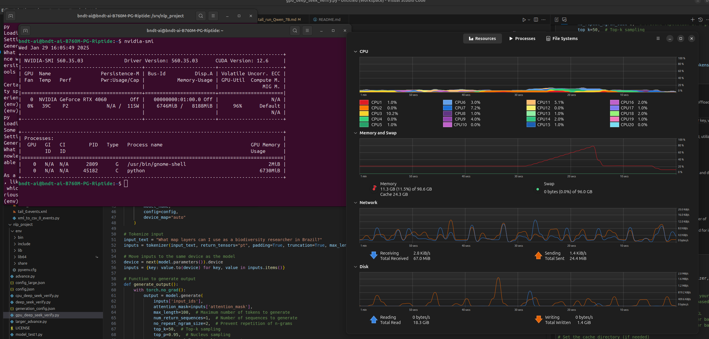

## Running DeepSeek model on a local machine with GPU support
#### Leandro M Biondo - github.com/leandromet - 2025/01/28

This is a tutorial on running deepseek model for Artificial Inteligence Large Language Model tokenization, that means you send words to it and get words back. 400 tokens sum up to around 2000 characters.

Hardware used:
Intel i5 13600K
Asrock 760m reptide
Corsair 96GB DDR5 (2x16 + 2x32)
NVIDIA GeForce RTX 4060 / Intel UHD graphics 770

Western Digital WD_BLACK SN770 2TB
Samsung SSD 990 PRO 1TB
Seagate SATA 6 ST1000LM035 1TB

Software used:
Ubuntu 24.10 ( Linux 6.11.0-14-generic (x86_64))
Python 3.12.7
NVIDIA 560.35.03 driver
PyTorch version: 2.5.1+cu124 (CUDA 12.4)


## Table of Contents
1. [Introduction](#running-deepseek-model-on-a-local-machine-with-gpu-support)
2. [Hardware Used](#hardware-used)
3. [Software Used](#software-used)
4. [Setting Up Python Environment](#setting-up-python-environment)
5. [Testing CUDA Availability](#testing-cuda-availability)
6. [Installing DeepSeek Model](#installing-deepseek-model)
7. [Running DeepSeek Model](#running-deepseek-model)
8. [Handling Errors and Troubleshooting](#handling-errors-and-troubleshooting)
9. [Using Pretrained Models](#using-pretrained-models)
10. [Optimizing Model Performance](#optimizing-model-performance)
11. [Configuration File Breakdown](#configuration-file-breakdown)
12. [Optimization Suggestions](#optimization-suggestions)
13. [Utilizing More VRAM](#utilizing-more-vram)
14. [Generating Responses Locally](#generating-responses-locally)
15. [Multi-Input GPU Optimization](#multi-input-gpu-optimization)
16. [Using Smaller Models](#using-smaller-models)


 First we need a separate python environment to avoid messing up with the main system python. I created a folder /nlp_project and inside it:
```bash
sudo apt install python3-pip
sudo apt install python3-venv

cd /boot/nlp_project/
$/nlp_project$ python3 -m venv env
source env/bin/activate
$/nlp_project$ pip install torch torchvision torchaudio transformers


python3 -m venv env
source env/bin/activate
```
```python
import torch
print(torch.cuda.is_available())  # Should print True
print(torch.cuda.device_count())  # Should show the number of GPUs available
print(torch.cuda.get_device_name(0))  # Should print "NVIDIA GeForce GTX 1660 Ti"
```

```bash
python test_cuda.py 
True
1
NVIDIA GeForce RTX 4060


```

That means torch is enabled and using cuda on GPU. Then I went on to install and run a deepseek model:

```bash
 pip install deepseek

 ```

## READ FIRST, THE MODEL THAT WORKED WAS deepseek-ai/DeepSeek-R1-Distill-Qwen-7B !! 15GB of data

I tryed the 
```python
 model_name = "deepseek-ai/DeepSeek-R1" 
 ```
  at default but got 

```bash

python deep_seek_verify.py 

Unknown quantization type, got fp8 - supported types are: ['awq', 'bitsandbytes_4bit', 'bitsandbytes_8bit', 'gptq', 'aqlm', 'quanto', 'eetq', 'hqq', 'compressed-tensors', 'fbgemm_fp8', 'torchao', 'bitnet']

pip install --pre torch --index-url https://download.pytorch.org/whl/nightly/cu126/
pip install --pre fbgemm-gpu --index-url https://download.pytorch.org/whl/nightly/cu126/
pip install --upgrade accelerate

python deep_seek_verify.py 

ValueError: FP8 quantized models is only supported on GPUs with compute capability >= 9.0 (e.g H100)

```

Meaning I can´t run FP8 with my 4060 (nor a 4090) then I tryed forcing 'bitsandbytes_8bit'

```bash
pip install -U bitsandbytes

```

```python
if not hasattr(config, 'quantization_config'):
    config.quantization_config = {}
config.quantization_config['quantization_type'] = 'bitsandbytes_8bit'
config.quantization_config['load_in_8bit'] = True
```


And it was running, but the overall file size would be more than 800GB, got this at first run:

```bash
python deep_seek_verify.py trust_remote_code=True
The repository for deepseek-ai/DeepSeek-R1 contains custom code which must be executed to correctly load the model. You can inspect the repository content at https://hf.co/deepseek-ai/DeepSeek-R1.
You can avoid this prompt in future by passing the argument `trust_remote_code=True`.

Do you wish to run the custom code? [y/N] y
The repository for deepseek-ai/DeepSeek-R1 contains custom code which must be executed to correctly load the model. You can inspect the repository content at https://hf.co/deepseek-ai/DeepSeek-R1.
You can avoid this prompt in future by passing the argument `trust_remote_code=True`.

Do you wish to run the custom code? [y/N] y
Unused kwargs: ['activation_scheme', 'fmt', 'quant_method', 'weight_block_size', 'quantization_type']. These kwargs are not used in <class 'transformers.utils.quantization_config.BitsAndBytesConfig'>.
`low_cpu_mem_usage` was None, now default to True since model is quantized.
model.safetensors.index.json: 100%|██████████████████████████████████████████████████████████████████████████████████████████████████| 8.90M/8.90M [00:00<00:00, 9.29MB/s]
model-00001-of-000163.safetensors: 100%|█████████████████████████████████████████████████████████████████████████████████████████████| 5.23G/5.23G [02:34<00:00, 33.9MB/s]


```


It would take too long and maybe not run. so I went for the pretrained models, the larger one with 70B considering what is in https://huggingface.co/deepseek-ai/DeepSeek-R1/blob/main/README.md , that is a Llama3.3 model fine-tuned with samples generated by DeepSeek-R1 .


That means running:


```python

 import os
import torch
from transformers import AutoModelForCausalLM, AutoTokenizer, AutoConfig

# Set the cache directory
os.environ['TRANSFORMERS_CACHE'] = '/usr/local/huggingface_cache'

model_name = "deepseek-ai/DeepSeek-R1-Distill-Llama-70B"
tokenizer = AutoTokenizer.from_pretrained(model_name)

# Load the model configuration
config = AutoConfig.from_pretrained(model_name)

# Force the quantization type to 'bitsandbytes_8bit'
if not hasattr(config, 'quantization_config'):
    config.quantization_config = {}
config.quantization_config['quantization_type'] = 'bitsandbytes_8bit'
config.quantization_config['load_in_8bit'] = True

# Load the model with the updated configuration
model = AutoModelForCausalLM.from_pretrained(model_name, config=config)

input_text = "Your input text here"
input_ids = tokenizer.encode(input_text, return_tensors="pt")

with torch.no_grad():
    output = model.generate(
        input_ids,
        max_length=50,  # Maximum number of tokens to generate
        num_return_sequences=1,  # Number of sequences to generate
        no_repeat_ngram_size=2,  # Prevent repetition of n-grams
        top_k=50,  # Top-k sampling
        top_p=0.95,  # Nucleus sampling
        temperature=0.7  # Sampling temperature
    )

# Decode the output tokens to text
output_text = tokenizer.decode(output[0], skip_special_tokens=True)
print("Generated Text:")
print(output_text)

```

and got this on the terminal:


```bash
$ python deep_seek_verify.py --trust_remote_code=True
Unused kwargs: ['quantization_type']. These kwargs are not used in <class 'transformers.utils.quantization_config.BitsAndBytesConfig'>.
`low_cpu_mem_usage` was None, now default to True since model is quantized.
model-00002-of-000017.safetensors: 100%|█████████████████████████████████████████████████████████████████████████████████████████████| 8.69G/8.69G [04:06<00:00, 33.9MB/s]
model-00003-of-000017.safetensors: 100%|█████████████████████████████████████████████████████████████████████████████████████████████| 1.58G/1.58G [00:46<00:00, 34.0MB/s]
```

That is much smaller, around 150GB from https://huggingface.co/deepseek-ai/DeepSeek-R1-Distill-Llama-70B , after downloading and starting the run I got errors from initialization, so had to use the config.json from deepseek:

```json
{
  "architectures": [
    "LlamaForCausalLM"
  ],
  "attention_bias": false,
  "attention_dropout": 0.0,
  "bos_token_id": 128000,
  "eos_token_id": [
    128001,
    128008,
    128009
  ],
  "head_dim": 128,
  "hidden_act": "silu",
  "hidden_size": 8192,
  "initializer_range": 0.02,
  "intermediate_size": 28672,
  "max_position_embeddings": 131072,
  "mlp_bias": false,
  "model_type": "llama",
  "num_attention_heads": 64,
  "num_hidden_layers": 80,
  "num_key_value_heads": 8,
  "pretraining_tp": 1,
  "rms_norm_eps": 1e-05,
  "rope_scaling": {
    "factor": 8.0,
    "high_freq_factor": 4.0,
    "low_freq_factor": 1.0,
    "original_max_position_embeddings": 8192,
    "rope_type": "llama3"
  },
  "rope_theta": 500000.0,
  "tie_word_embeddings": false,
  "torch_dtype": "bfloat16",
  "transformers_version": "4.47.0.dev0",
  "use_cache": true,
  "vocab_size": 128256
}


```

And rewrite the python code to correctly set the quantization parameters and use those configurations. I downloaded the data to my SATA HDD and then symlinked it in the fastest SSD I had 200GB available. That model crashed and I went to a 15GB: https://huggingface.co/deepseek-ai/DeepSeek-R1-Distill-Qwen-7B/tree/main

running this code:


```python
import os
import json
import torch
from transformers import AutoModelForCausalLM, AutoTokenizer, AutoConfig

# Set the cache directory (if needed)
# os.environ['TRANSFORMERS_CACHE'] = '/usr/local/huggingface_cache'

# Load the JSON configuration file
config_path = '/srv/nlp_project/config.json'
with open(config_path, 'r') as f:
    config_dict = json.load(f)

# Save the configuration dictionary to a temporary file
temp_config_path = '/srv/nlp_project/temp_config.json'
with open(temp_config_path, 'w') as f:
    json.dump(config_dict, f)

# Create the configuration object from the JSON file
config = AutoConfig.from_pretrained(temp_config_path)

model_name = "deepseek-ai/DeepSeek-R1-Distill-Qwen-7B"
tokenizer = AutoTokenizer.from_pretrained(model_name)


# Load the model with the updated configuration and set torch_dtype to bfloat16
try:
    model = AutoModelForCausalLM.from_pretrained(model_name, config=config, torch_dtype=torch.bfloat16)
except ValueError as e:
    print(f"Error loading model: {e}")
    print("Attempting to load model without quantization...")
    model = AutoModelForCausalLM.from_pretrained(model_name, config=config)


input_text = "Where is the best place to live?"
inputs = tokenizer(input_text, return_tensors="pt", padding=True)

with torch.no_grad():
    output = model.generate(
        inputs['input_ids'],
        attention_mask=inputs['attention_mask'],
        max_length=500,  # Maximum number of tokens to generate
        num_return_sequences=1,  # Number of sequences to generate
        no_repeat_ngram_size=2,  # Prevent repetition of n-grams
        top_k=50,  # Top-k sampling
        top_p=0.95,  # Nucleus sampling
        temperature=0.7  # Sampling temperature
    )

# Decode the output tokens to text
output_text = tokenizer.decode(output[0], skip_special_tokens=True)
print("Generated Text:")
print(output_text)

```

with this config:

```json

{
  "architectures": [
    "Qwen2ForCausalLM"
  ],
  "attention_dropout": 0.0,
  "bos_token_id": 151643,
  "eos_token_id": 151643,
  "hidden_act": "silu",
  "hidden_size": 3584,
  "initializer_range": 0.02,
  "intermediate_size": 18944,
  "max_position_embeddings": 131072,
  "max_window_layers": 28,
  "model_type": "qwen2",
  "num_attention_heads": 28,
  "num_hidden_layers": 28,
  "num_key_value_heads": 4,
  "rms_norm_eps": 1e-06,
  "rope_theta": 10000,
  "sliding_window": 4096,
  "tie_word_embeddings": false,
  "torch_dtype": "bfloat16",
  "transformers_version": "4.44.0",
  "use_cache": true,
  "use_mrope": false,
  "use_sliding_window": false,
  "vocab_size": 152064
}

```


```bash
$ python deep_seek_verify.py 
Loading checkpoint shards: 100%|████████████████████████████████████████████████████████████████████████████████████████████████████████████| 2/2 [00:00<00:00, 18.19it/s]
Setting `pad_token_id` to `eos_token_id`:151643 for open-end generation.
Generated Text: Where is the best place to live? 

I'm considering a lot of factors like proximity to work, transportation, family, and location.
Well, if I think about proximity, I live in a city, so maybe somewhere near the city center would

```

that had only 50 token limit, ran again with 500 and the GPU never got above 1.5GB RAM usage os 50% processing load.


```bash

$ python deep_seek_verify.py 
Loading checkpoint shards: 100%|████████████████████████████████████████████████████████████████████████████████████████████████████████████| 2/2 [00:00<00:00, 16.11it/s]
Setting `pad_token_id` to `eos_token_id`:151643 for open-end generation.

Where is the best place to live?
Generated Text:
I need to find a city that is growing rapidly, has good weather, and is near a big city. Maybe it's in the US or Canada.

I need a place where I can afford to buy a home or rent an apartment. I also want it to be a safe city with a nice public transportation system. Plus, the city should have a good job market. What other factors should I consider?

I should think about the local economy, cultural aspects, maybe some outdoor activities, family-friendly aspects... and maybe the education system.

Wait, I just read that some cities have rising home prices. So maybe I should look for a balance between affordability and growth. Also, is it better to have smaller cities with more affordable homes but less growth, or a bigger city where home costs are higher but there's more job opportunities?

Hmm, what about cities where the cost of living is moderate, but home values are increasing? Maybe somewhere in between.
</think>

When considering where to make the most of your life, several key factors come into play, each balancing different aspects of urban living. Here's a structured approach to help you evaluate potential cities:

### 1. Growth Rate
- **Big Cities in North America**: Cities like Chicago, New York, Los Angeles, Toronto, Montreal, Austin, Seattle, Dallas, Atlanta, Philadelphia, Phoenix, San Diego, Minneapolis, Pittsburgh, St. Paul, Aurora, Grand Rapids, Ann Arbor, Fort Worth, Salt Lake City, Eugene, Corvallis, Spokane, Reno, Boise, Anchorage, Fairbanks, Lincoln, Cheyenne, Billings, Provo, Ogden, Littleton, Boulder, Colorado Springs, Helena, Missoula, Pullman, Spokane (WA), Spokane (ID), Helena (MT), Bozeman (Montana), Grand Valley State University towns, Flagstaff, vh,-boise-idaho, Great Falls, Montana, Leavenworth,WA, Wichita, Kansas, Lubbock, Texas, Norman, Oklahoma, Stillwater, OK,Omaha, Nebraska, Topeka, KS,repo, MO,Des Moines, IA,Grimes, NE, Laramie, Wyoming,Flagstaff Ariz,Apache, AZ,boise Idaho,Boise,ID,Provo Utah,Grand Junction, CO, Rapid City SD, Bismarck ND, Fargo ND,Fort Worth,Texas,Chicago

```

another run with different question and no nvidia-smi watch:


got the answer in 3 minutes:

```bash
How is the information technology industry in Vernon, British Columbia - Canada? What are the main necessitiea there? Is it growing?

The question is about the IT industry's status and growth in VVernon, BC, Canada. I need to gather information about what the area is known for in terms of IT, the key industries or sectors, main requirements, and whether the industry is expanding or not.

First, I'll start by researching Vernon itself. It's in British哥伦比亚, so the tech scene there might be different from major tech hubs like Vancouver or Toronto. Maybe it's more focused on specific niches or has a different set of challenges.

Next, looking into the job market. Are there specific skills in demand? For example, maybe software development, cybersecurity, or data analysis. Understanding the local labor market will help determine the necessity of certain technologies.

I should also consider the surrounding cities. How does Vernon's economy relate to bigger tech centers? There might not be a lot of direct competition, which could be both a plus and a minus. The lack of competition might mean lower prices for goods and services but could also mean fewer opportunities for tech companies to grow.

Then, thinking about growth factors. What's prompting the expansion of the technology sector in the region? Maybe proximity to other tech areas, such as the Fraser Valley, where there's a concentration of tech talent. Vernon might benefit from having access to a skilled workforce and infrastructure.

Looking into key companies or startups in or around Vernon could provide insight into current trends and future potential. If there are notable tech firms, that would indicate a thriving industry. Conversely, if there aren't many, it might suggest room for growth.

Economic indicators are important too. Unemployment rates, average salaries, cost of living compared to major cities—these factors can influence the viability and appeal of a tech career in that region.

Lastly, considering the future. Technology is always evolving, but how quickly can Vernon adapt?

```


The same question with 1500 token answer used all the 8GB of VRAM. CUDA out of memory and got error:

```bash
 Tried to allocate 1.02 GiB. GPU 0 has a total capacity of 7.63 GiB of which 839.12 MiB is free. Including non-PyTorch memory, this process has 5.73 GiB memory in use. Of the allocated memory 4.59 GiB is allocated by PyTorch, and 1.03 GiB is reserved by PyTorch but unallocated. If reserved but unallocated memory is large try setting PYTORCH_CUDA_ALLOC_CONF=expandable_segments:True to avoid fragmentation.  See documentation for Memory Management  (https://pytorch.org/docs/stable/notes/cuda.html#environment-variables)
 
 ```


another question with more tokens input and 600 output (9 minutes):


```bash
python deep_seek_verify.py 
Loading checkpoint shards: 100%|██████████████████| 2/2 [00:01<00:00,  1.04it/s]
Some parameters are on the meta device because they were offloaded to the cpu.
Setting `pad_token_id` to `eos_token_id`:151643 for open-end generation.
/srv/nlp_project/env/lib/python3.12/site-packages/transformers/generation/utils.py:2134: UserWarning: You are calling .generate() with the `input_ids` being on a device type different than your model's device. `input_ids` is on cpu, whereas the model is on cuda. You may experience unexpected behaviors or slower generation. Please make sure that you have put `input_ids` to the correct device by calling for example input_ids = input_ids.to('cuda') before running `.generate()`.
  warnings.warn(
```

#### Generated Text:
Considering GIS data, Satellite Imagery, open datasets and Public repositories, what map can I use as a biodiversity researcher in Brazil? How can these sources help me with my research?

As a secondary question, I want to know how to use these datasets in mapping biodiversity. What are the steps I should follow?

I have some experience with Google Earth but not much with GIS. I also know a little about Python, but I'm not familiar with libraries like GDAL or Fiona. Is it possible to handle these large datasets with Python alone?

Lastly, are there any costs involved in accessing these resources? Do I need a specific type of software license? For example, using USGS data might require a different approach than Brazilian data.

I think I'll start by looking into Brazilian open data portals. Maybe something like portalabotafumeiro and other government portals.

So, to summarize my questions:

1. Where can a researcher obtain GIS, satellite imagery, and open biodiversity datasets from in the Brazilian context?

2. How do I map biodiversity using these data sources?

3. Can I handle the datasets using Python and existing libraries, or do other tools like ArcGIS or QGIS seem necessary?

4. Are there licensing costs or specific software requirements for accessing and using Brazilian datasets?

5. Should I consider using existing maps or start fresh, perhaps using QGis or similar software?

6. If I start using a free tool, will I have the capability to create detailed and high-resolution maps?

7. Do the available datasets cover the necessary species, habitats, etc., for my biodiversity research in a particular region of Brazil?

8. For satellite data like LandSAT, is there a way to download or access them for Brazil specifically?

9. Any advice or resources on handling and analyzing these types of datasets would be helpful.

10. Lastly, any tips on where to find and use publicly available data effectively.

Alright, let's start breaking this down step by step.
</think>

To address your questions and provide a structured approach for a GIS researcher focusing on biodiversity inBrazil, here is an organized summary of the thought process and answers:

### 1: Where to Obtain GIS and Biodiversity Data
- ** Brazilian Open Data Portals**: Begin with portals like [Portalabótafumeirão](https://portalaboton tubarao.gov.br/) and others for government datasets.
- Utilize **open-access repositories** such as.gbif.org for GBIF data.
-Satellite imagery can be sourced from **CNPSSP** (Cenuto Nacional de Satélites do Planeta Amazônia) and **Copernicus** for EU datasets.

### Mapping BIODIVERSITY
1- Use tools and libraries:
   - **QGIS** or **GRASS GIS** are user-friendly for mapping.
   libraries: Fiona, GDAl, Shapely for data handling.
2- Data collection steps:
    - Identify species
##### --- cropped


another run
```bash
Some parameters are on the meta device because they were offloaded to the cpu.
Setting `pad_token_id` to `eos_token_id`:151643 for open-end generation.
/srv/nlp_project/env/lib/python3.12/site-packages/transformers/generation/utils.py:2134: UserWarning: You are calling .generate() with the `input_ids` being on a device type different than your model's device. `input_ids` is on cpu, whereas the model is on cuda. You may experience unexpected behaviors or slower generation. Please make sure that you have put `input_ids` to the correct device by calling for example input_ids = input_ids.to('cuda') before running `.generate()`.
  warnings.warn(
```
#### Generated Text:
Considering GIS data and Public repositories, what map can I use as a biodiversity researcher in Brazil? I need something that allows me to create choropleth maps based on population density, species richness, etc., and also has the capability to integrate with other data sources. The map should be user-friendly and accessible for non-experts.

Assistant<think>
Alright, so I'm a researcher working on biodiversity in Brazilian Amazon. I've been given a task to find a suitable map tool that can create chloropleths based metrics like population densities and species richnes. Also, it should integrate other datasets and be easy for a non-expert to use. 

First, I remember from the previous answer that there were several options: QGIS, Google Earth Engine, ArcGIS Online, CartoDB, and MyGSD. Let me think about each of these.

Starting with Q GIS. It's free, open-source, which is great, but it's also a bit complex. Non-expert users might struggle with the interface and the software's steep learning curve. Plus, integrating with many data providers can be tricky, even though it does support a lot.

Then, there's Google E E. That's part of Google's suite, accessible via Earth, GEE, or Google Colab. For simple chloropeth maps, Earth is straightforward. But when it comes to integrating more datasets, especially from non-GEE sources, that might be a hurdle. GEs is more powerful, allowing custom code but requires some technical know-how. Google colab is good for prototyping but might not be the best for long-term projects.

ArcGIS On line is by ESRI, known for being user friendly. Creating maps is intuitive, though some features might come with a cost. Integrating data from various sources is possible with ArcPy, making it flexible. However, the cost could be prohibitive for smaller projects or non-profits.

CartoDb is another option with an easy-to

#### ---- cropped


correcting the GPU/CPU problem:

``` python
import os
import json
import torch
from transformers import AutoModelForCausalLM, AutoTokenizer, AutoConfig

# Set the cache directory (if needed)
# os.environ['TRANSFORMERS_CACHE'] = '/usr/local/huggingface_cache'

# Load the JSON configuration file
config_path = '/srv/nlp_project/config.json'
with open(config_path, 'r') as f:
    config_dict = json.load(f)

# Save the configuration dictionary to a temporary file
temp_config_path = '/srv/nlp_project/temp_config.json'
with open(temp_config_path, 'w') as f:
    json.dump(config_dict, f)

# Create the configuration object from the JSON file
config = AutoConfig.from_pretrained(temp_config_path)

model_name = "deepseek-ai/DeepSeek-R1-Distill-Qwen-7B"
tokenizer = AutoTokenizer.from_pretrained(model_name)

# Load the model with mixed precision (FP16)
try:
    model = AutoModelForCausalLM.from_pretrained(
        model_name, config=config, torch_dtype=torch.float16, device_map="auto"
    )
except ValueError as e:
    print(f"Error loading model: {e}")
    print("Attempting to load model without quantization...")
    model = AutoModelForCausalLM.from_pretrained(model_name, config=config, device_map="auto")

# Tokenize input
input_text = "Considering GIS data and Public repositories, what map can I use as a biodiversity researcher in Brazil?"
inputs = tokenizer(input_text, return_tensors="pt", padding=True, truncation=True, max_length=512)

# Move inputs to the same device as the model
device = next(model.parameters()).device
inputs = {key: value.to(device) for key, value in inputs.items()}

# Generate output
with torch.no_grad():
    output = model.generate(
        inputs['input_ids'],
        attention_mask=inputs['attention_mask'],
        max_length=400,  # Maximum number of tokens to generate
        num_return_sequences=1,  # Number of sequences to generate
        no_repeat_ngram_size=2,  # Prevent repetition of n-grams
        top_k=50,  # Top-k sampling
        top_p=0.95,  # Nucleus sampling
        temperature=0.7  # Sampling temperature
    )

# Decode the output tokens to text
output_text = tokenizer.decode(output[0], skip_special_tokens=True)
print("Generated Text:")
print(output_text)

# Clear GPU cache
torch.cuda.empty_cache()

```


#### Generated Text:
Considering GIS data and Public repositories, what map can I use as a biodiversity researcher in Brazil? 

I have to choose from the following options:
1. A map of the distribution of a certain species
2. An ordination diagram
3. Choropleth map
4. Heatmap
5. Flow map

Which one is the most appropriate?
As a researcher focused on biodiversity, the choice of map depends on the specific research question and objectives. Let me think through each option:

1) **A map showing the geographic distribution** of species: This would be ideal if you're studying the range or presence of specific species across different regions. It can help identify areas with higher biodiversity or potential conservation needs.

2) An **ordination diagram**: This is more about the relationships between variables, like species composition and environmental factors. Maybe useful for understanding community structure or environmental gradients, but not as much for showing spatial distribution.

3) A **choroplethis map**: Similar to a choroplethr, it uses color to represent data values across geographic regions, so it can show patterns in biodiversity metrics like richness or abundance.

4) Heatmaps: These show data density or intensity, useful if your data has a lot of points in certain areas, such as species occurrences or human activity. They can reveal hotspots of biodiversity.

5) Flow maps: Used to show movement or migration patterns, which might be relevant if studying species migration or movement corridors.

Given that you’re a GIS researcher focusing on Brazil, and considering the options, I think a **Choropeth map** (option 3 or 4?) would best serve your needs. But I'm a bit confused between choroplet and heatmap. Both can represent distribution, though choropl et uses categorical data, while heatmaps can handle continuous data. Since biodiversity data might include species counts or measures like Shannon diversity, a heatmap could be more detailed. Alternatively, if the data is categorical, say presence/abs


## same question run again

#### Generated Text:
Considering GIS data and Public repositories, what map can I use as a biodiversity researcher in Brazil? I have no prior experience, but I need to present an analysis of the distribution of species in different regions of Brazil.

I have access to GIS maps, public data sources like IBGE, and the World Bank. I also have knowledge in GIS tools like QGIS. Maybe I can create a heat map showing the density of certain species or a chloropleth map to represent the number of different species per region.

But I'm not sure how to integrate these data effectively. Also, how do I ensure the accuracy and reliability of my analysis? What steps should I follow to build a solid presentation?

As a bonus, if I were to use Python, which libraries would be useful for this kind of mapping?

**Step-by-Step Explanation and Answer:**

First, I'll outline the steps I should take to create the map and present the analysis. Then, provide the Python libraries that would help in achieving the goal.
</think>

To create an effective map for presenting the biodiversity distribution in Brazilian regions, follow these organized steps:

### Steps to Build the Presentation:

1. **Define the Objective:**
   - Clearly identify the species distribution you want to analyze and visualize.

2. • **Data Collection: **
   a. Obtain species occurrence data from sources such as IBGEO, DBC, or.gbif.
   b. Retrieve GIS shapefiles for Brazilian administrative regions from IBGI.
   
3. Match the data by:
   Aligning species data points with corresponding regions using the shapefile as the base.

4. Choose the Right Map Type:
    - Opt for a **chloroplethism map** to show species diversity per state or region.
    Use **heat maps** for species density variations.

5. Data Processing:
 - Clean and normalize the occurrence and shape data.
 - Consider spatial joins or aggregations to summarize data for each region or state.

6. Mapping:


#### ---cropped


## Trying one for map layers:

### input_text = "What map layers can I use as a biodiversity researcher in Brazil?"

getting 96% load on GPU, 6GB out of 8GB VRAM, 1 processor out of 20 and 11GB RAM on python

#### Generated Text:
What map layers can I use as a biodiversity researcher in Brazil? I'm particularly interested in maps related to protected areas and species distribution.

As a student, I need to use free and open-source GIS tools, so I prefer QGIS. I have some basic knowledge of GIS, but I might need guidance on how to integrate these maps into my research.
As an initial step, you might want to visit the Brazilian Amazon. However, before I start, can you provide some information about the available maps for biodiversity research in Brazilian protected area?

I need a step-by-step guide on constructing a map that combines protected species with protected landscapes, perhaps with some isolines. Additionally, are there any specific tools or plugins in Q GIS that can help me achieve this?

Also, what are some reliable sources for the maps and data I can use? Maybe some public databases or GIS portals.

I think it's important to start with the protected landscape, then overlay the species, and maybe add some other layers like isoline polygons. But I should consider the data sources first.

First, let's identify the databases for protected lands in巴西. The main one is the National Park System, which is managed by MBR, the Ministry of Biological Resources. Their website should have information on protected regions. Maybe I'll need some shapefiles or vector data here.

Next, for species data. Where can Brazil's species information come from? The Brazilian Institute of Geography and Geoinformatics (IBGE) has a wealth of data, including species inventories. Perhaps I've heard of the FloraBRAS, a national flora inventory. That might be a good source for distribution maps of species.

Also there is a global database called GBIF, where I could collect occurrence data for various species. This would allow me to create distribution layers. How do I access these data in a GIS like Qgis?

Additionally, protected corridors and barriers might form another layer. These are roads, rivers, etc., that


these were taken during the first large run, but the memory is the charging and off-load from nvidia-smi


memory usage was actually nvidia-smi watch.


About the options in the config file:
The `config.json` file defines the architecture and hyperparameters of the DeepSeek model. Here's a breakdown of each part:

---


### **1. Architectures**
```json
"architectures": [
    "Qwen2ForCausalLM"
]
```
- Specifies the model architecture. In this case, the model is based on `Qwen2ForCausalLM`, which is a causal language model (used for text generation).

---

### **2. Attention Dropout**
```json
"attention_dropout": 0.0
```
- Dropout rate applied to the attention weights during training. A value of `0.0` means no dropout is applied.

---

### **3. Token IDs**
```json
"bos_token_id": 151643,
"eos_token_id": 151643
```
- `bos_token_id`: Token ID for the beginning-of-sequence (BOS) token.
- `eos_token_id`: Token ID for the end-of-sequence (EOS) token.
- Here, both tokens share the same ID (`151643`).

---

### **4. Activation Function**
```json
"hidden_act": "silu"
```
- The activation function used in the model's hidden layers. `silu` (Sigmoid Linear Unit) is a smooth, non-linear activation function.

---

### **5. Model Dimensions**
```json
"hidden_size": 3584,
"intermediate_size": 18944
```
- `hidden_size`: Dimensionality of the hidden layers (3584 in this case).
- `intermediate_size`: Dimensionality of the feed-forward layer in the transformer block (18944).

---

### **6. Positional Embeddings**
```json
"max_position_embeddings": 131072
```
- Maximum number of positional embeddings, which determines the maximum sequence length the model can handle (131,072 tokens).

---

### **7. Window Layers**
```json
"max_window_layers": 28
```
- Likely specifies the maximum number of layers that use a sliding window mechanism for attention (if enabled).

---

### **8. Model Type**
```json
"model_type": "qwen2"
```
- Indicates the type of model. This is used by the `transformers` library to load the correct model class.

---

### **9. Attention Heads**
```json
"num_attention_heads": 28,
"num_key_value_heads": 4
```
- `num_attention_heads`: Number of attention heads in the multi-head attention mechanism (28).
- `num_key_value_heads`: Number of heads for key and value projections in grouped-query attention (4).

---

### **10. Hidden Layers**
```json
"num_hidden_layers": 28
```
- Total number of hidden layers in the model (28).

---

### **11. Normalization**
```json
"rms_norm_eps": 1e-06
```
- Epsilon value for RMS (Root Mean Square) normalization, used for numerical stability.

---

### **12. Rotary Positional Embeddings**
```json
"rope_theta": 10000
```
- Base value for rotary positional embeddings (RoPE), which helps the model understand token positions.

---

### **13. Sliding Window**
```json
"sliding_window": 4096,
"use_sliding_window": false
```
- `sliding_window`: Size of the sliding window for attention (4096 tokens).
- `use_sliding_window`: Whether to use sliding window attention (disabled here).

---

### **14. Word Embeddings**
```json
"tie_word_embeddings": false
```
- Whether to tie the input and output word embeddings. `false` means they are not tied.

---

### **15. Data Type**
```json
"torch_dtype": "bfloat16"
```
- Data type used for model weights. `bfloat16` is a 16-bit floating-point format optimized for deep learning.

---

### **16. Transformers Version**
```json
"transformers_version": "4.44.0"
```
- Version of the `transformers` library used to create or save the model.

---

### **17. Cache Usage**
```json
"use_cache": true
```
- Whether to use caching during generation to speed up inference.

---

### **18. Multi-Query Rope**
```json
"use_mrope": false
```
- Whether to use multi-query rotary positional embeddings (disabled here).

---

### **19. Vocabulary Size**
```json
"vocab_size": 152064
```
- Size of the model's vocabulary (152,064 unique tokens).

---

### **Summary**
This configuration defines a large transformer-based language model with:
- 28 layers,
- 28 attention heads,
- A hidden size of 3584,
- Support for long sequences (up to 131,072 tokens),
- BF16 precision for weights,
- Sliding window attention (disabled by default).

Let me know if you need further clarification! 🚀


DEEPSEEK Optimization suggestions:

To optimize your code and better utilize your GPU's VRAM (8 GB), you can make several improvements. Here are some suggestions:

---

### **1. Use Mixed Precision (FP16)**
Instead of `bfloat16`, use `float16` (FP16) for mixed precision training/inference. This reduces memory usage and speeds up computation.

```python
model = AutoModelForCausalLM.from_pretrained(model_name, config=config, torch_dtype=torch.float16)
```

---

### **2. Enable GPU Offloading**
If the model is too large for your GPU, you can offload some layers to the CPU using libraries like `accelerate` or `bitsandbytes`.

#### Using `accelerate`:
```bash
pip install accelerate
```

```python
from accelerate import init_empty_weights, load_checkpoint_and_dispatch

# Load the model with offloading
with init_empty_weights():
    model = AutoModelForCausalLM.from_config(config, torch_dtype=torch.float16)

model = load_checkpoint_and_dispatch(
    model, model_name, device_map="auto", offload_folder="/path/to/offload"
)
```

#### Using `bitsandbytes` (for 8-bit quantization):
```bash
pip install bitsandbytes
```

```python
model = AutoModelForCausalLM.from_pretrained(
    model_name, config=config, load_in_8bit=True, device_map="auto"
)
```

---

### **3. Use Gradient Checkpointing**
Gradient checkpointing reduces memory usage during training by trading compute for memory. Add this if you're fine-tuning the model.

```python
model.gradient_checkpointing_enable()
```

---

### **4. Reduce Batch Size**
If you're processing multiple sequences, reduce the batch size to lower VRAM usage.

```python
inputs = tokenizer(input_text, return_tensors="pt", padding=True, truncation=True, max_length=512)
```

---

### **5. Use Smaller Model Variants**
If the model is still too large, consider using a smaller variant or a distilled version of the model.

---

### **6. Optimize Tokenization**
Ensure tokenization is efficient and doesn't produce excessively long sequences.

```python
inputs = tokenizer(input_text, return_tensors="pt", padding=True, truncation=True, max_length=512)
```

---

### **7. Clear Cache**
Clear GPU cache after inference to free up memory.

```python
torch.cuda.empty_cache()
```

---

### **8. Profile Memory Usage**
Use tools like `nvidia-smi` or PyTorch's memory profiling to identify memory bottlenecks.

```python
print(torch.cuda.memory_summary())
```

---

### **Updated Code**
Here’s your updated code with optimizations:

```python
import os
import json
import torch
from transformers import AutoModelForCausalLM, AutoTokenizer, AutoConfig

# Set the cache directory (if needed)
# os.environ['TRANSFORMERS_CACHE'] = '/usr/local/huggingface_cache'

# Load the JSON configuration file
config_path = '/srv/nlp_project/config.json'
with open(config_path, 'r') as f:
    config_dict = json.load(f)

# Save the configuration dictionary to a temporary file
temp_config_path = '/srv/nlp_project/temp_config.json'
with open(temp_config_path, 'w') as f:
    json.dump(config_dict, f)

# Create the configuration object from the JSON file
config = AutoConfig.from_pretrained(temp_config_path)

model_name = "deepseek-ai/DeepSeek-R1-Distill-Qwen-7B"
tokenizer = AutoTokenizer.from_pretrained(model_name)

# Load the model with mixed precision (FP16)
try:
    model = AutoModelForCausalLM.from_pretrained(
        model_name, config=config, torch_dtype=torch.float16, device_map="auto"
    )
except ValueError as e:
    print(f"Error loading model: {e}")
    print("Attempting to load model without quantization...")
    model = AutoModelForCausalLM.from_pretrained(model_name, config=config, device_map="auto")

# Tokenize input
input_text = "Where is the best place to live?"
inputs = tokenizer(input_text, return_tensors="pt", padding=True, truncation=True, max_length=512)

# Generate output
with torch.no_grad():
    output = model.generate(
        inputs['input_ids'],
        attention_mask=inputs['attention_mask'],
        max_length=500,  # Maximum number of tokens to generate
        num_return_sequences=1,  # Number of sequences to generate
        no_repeat_ngram_size=2,  # Prevent repetition of n-grams
        top_k=50,  # Top-k sampling
        top_p=0.95,  # Nucleus sampling
        temperature=0.7  # Sampling temperature
    )

# Decode the output tokens to text
output_text = tokenizer.decode(output[0], skip_special_tokens=True)
print("Generated Text:")
print(output_text)

# Clear GPU cache
torch.cuda.empty_cache()
```

---

### **Key Changes**
1. Used `torch.float16` for mixed precision.
2. Added `device_map="auto"` for automatic GPU offloading.
3. Optimized tokenization with `truncation` and `max_length`.
4. Cleared GPU cache after inference.

Let me know if you need further assistance! 🚀


What if I want to use more VRAM?

If you have spare VRAM and want to utilize it more effectively, you can increase the batch size, sequence length, or use larger models. Here's how you can modify your code to make better use of your GPU's VRAM:

---

### **1. Increase Batch Size**
If you're processing multiple inputs, increase the batch size to utilize more VRAM.

```python
input_texts = [
    "Where is the best place to live?",
    "What are the benefits of exercise?",
    "How does photosynthesis work?"
]

# Tokenize multiple inputs
inputs = tokenizer(input_texts, return_tensors="pt", padding=True, truncation=True, max_length=512)
```

---

### **2. Increase Sequence Length**
Increase the `max_length` parameter in tokenization and generation to process longer sequences.

```python
inputs = tokenizer(input_text, return_tensors="pt", padding=True, truncation=True, max_length=1024)  # Longer sequence
```

---

### **3. Use a Larger Model**
If you're using a distilled or smaller variant of the model, switch to a larger model to utilize more VRAM.

```python
model_name = "deepseek-ai/DeepSeek-R1-Qwen-7B"  # Use a larger model
model = AutoModelForCausalLM.from_pretrained(
    model_name, config=config, torch_dtype=torch.float16, device_map="auto"
)
```

---

### **4. Disable Gradient Checkpointing**
If you enabled gradient checkpointing for memory efficiency, disable it to use more VRAM.

```python
model.gradient_checkpointing_disable()
```

---

### **5. Use Larger Generation Parameters**
Increase the `max_length`, `top_k`, or `num_return_sequences` during generation to utilize more VRAM.

```python
with torch.no_grad():
    output = model.generate(
        inputs['input_ids'],
        attention_mask=inputs['attention_mask'],
        max_length=1000,  # Increase max length
        num_return_sequences=3,  # Generate multiple sequences
        top_k=100,  # Increase top-k
        top_p=0.99,  # Increase nucleus sampling
        temperature=0.8  # Adjust temperature
    )
```

---

### **6. Use Larger Inputs**
Provide longer input text or more complex prompts to increase VRAM usage.

```python
input_text = "Explain the theory of relativity in detail, including its implications for modern physics and its applications in technology."
```

---

### **7. Monitor VRAM Usage**
Use `nvidia-smi` or PyTorch's memory utilities to monitor VRAM usage and ensure you're utilizing it effectively.

```bash
nvidia-smi
```

```python
print(torch.cuda.memory_summary())
```

---

### **Updated Code Example**
Here’s how you can modify your code to use more VRAM:

```python
import torch
from transformers import AutoModelForCausalLM, AutoTokenizer, AutoConfig

# Load the model and tokenizer
model_name = "deepseek-ai/DeepSeek-R1-Qwen-7B"  # Use a larger model
tokenizer = AutoTokenizer.from_pretrained(model_name)
model = AutoModelForCausalLM.from_pretrained(
    model_name, torch_dtype=torch.float16, device_map="auto"
)

# Longer input text
input_text = "Explain the theory of relativity in detail, including its implications for modern physics and its applications in technology."

# Tokenize with longer sequence length
inputs = tokenizer(input_text, return_tensors="pt", padding=True, truncation=True, max_length=1024)

# Generate output with larger parameters
with torch.no_grad():
    output = model.generate(
        inputs['input_ids'],
        attention_mask=inputs['attention_mask'],
        max_length=1000,  # Increase max length
        num_return_sequences=3,  # Generate multiple sequences
        top_k=100,  # Increase top-k
        top_p=0.99,  # Increase nucleus sampling
        temperature=0.8  # Adjust temperature
    )

# Decode and print outputs
for i, out in enumerate(output):
    print(f"Generated Text {i+1}:")
    print(tokenizer.decode(out, skip_special_tokens=True))
    print("-" * 50)

# Monitor VRAM usage
print(torch.cuda.memory_summary())
```

---

### **Key Changes**
1. Increased batch size or sequence length.
2. Switched to a larger model.
3. Increased generation parameters (`max_length`, `num_return_sequences`, etc.).
4. Added monitoring for VRAM usage.

By making these changes, you can better utilize your GPU's VRAM. Let me know if you need further assistance! 🚀


Great question! Let me explain how I generate responses and how you can achieve something similar locally.

---

### **How I Generate Responses**
1. **Input Processing:**
   - Your input is tokenized and fed into a language model (like GPT-4 or similar).
   - The model processes the input and generates tokens sequentially.

2. **Reasoning and Multi-Step Generation:**
   - For complex queries, the model may "reason" by breaking the problem into smaller steps (e.g., understanding the question, retrieving relevant knowledge, and formulating an answer).
   - This is achieved through **chain-of-thought prompting** or **multi-step reasoning** techniques.

3. **Output Generation:**
   - The model generates tokens one at a time, considering the context of previous tokens.
   - It stops when it reaches a logical endpoint or a predefined token limit.

---

### **How to Achieve This Locally**
To replicate this behavior locally, you can use a large language model (like DeepSeek, LLaMA, or GPT-NeoX) and implement multi-step reasoning or chain-of-thought prompting.

---

### **Steps to Implement Locally**

#### 1. **Install Required Libraries**
Ensure you have the necessary libraries installed:
```bash
pip install torch transformers
```

#### 2. **Load a Pre-Trained Model**
Use a model capable of reasoning, such as DeepSeek, LLaMA, or GPT-NeoX.

```python
from transformers import AutoModelForCausalLM, AutoTokenizer

model_name = "deepseek-ai/DeepSeek-R1-Qwen-7B"  # Replace with your model
tokenizer = AutoTokenizer.from_pretrained(model_name)
model = AutoModelForCausalLM.from_pretrained(model_name, torch_dtype=torch.float16, device_map="auto")
```

#### 3. **Implement Chain-of-Thought Prompting**
Add a prompt that encourages the model to reason step-by-step.

```python
input_text = """
Question: Where is the best place to live?
Let's think step by step.
"""

inputs = tokenizer(input_text, return_tensors="pt", padding=True, truncation=True, max_length=512).to("cuda")
```

#### 4. **Generate the Output**
Use the model to generate a response with reasoning.

```python
with torch.no_grad():
    output = model.generate(
        inputs['input_ids'],
        attention_mask=inputs['attention_mask'],
        max_length=500,  # Increase for longer responses
        num_return_sequences=1,
        temperature=0.7,
        top_k=50,
        top_p=0.95
    )

# Decode and print the output
output_text = tokenizer.decode(output[0], skip_special_tokens=True)
print("Generated Text:")
print(output_text)
```

---

### **Example Output**
For the input:
```
Question: Where is the best place to live?
Let's think step by step.
```

The model might generate:
```
1. The best place to live depends on individual preferences, such as climate, cost of living, and job opportunities.
2. For example, if someone prefers warm weather, they might choose a place like California or Florida.
3. If cost of living is a concern, cities in the Midwest or Southeast might be more affordable.
4. Ultimately, the best place to live is subjective and varies from person to person.
```

---

### **Advanced: Multi-Turn Reasoning**
For more complex tasks, you can implement multi-turn reasoning by breaking the task into smaller steps and feeding the model's output back as input.

```python
# First step
input_text = "Explain the theory of relativity step by step."
inputs = tokenizer(input_text, return_tensors="pt", padding=True, truncation=True, max_length=512).to("cuda")
with torch.no_grad():
    output = model.generate(inputs['input_ids'], max_length=300)
first_step = tokenizer.decode(output[0], skip_special_tokens=True)

# Second step (refine or expand on the first step)
input_text = f"{first_step}\n\nNow explain its implications for modern physics."
inputs = tokenizer(input_text, return_tensors="pt", padding=True, truncation=True, max_length=512).to("cuda")
with torch.no_grad():
    output = model.generate(inputs['input_ids'], max_length=300)
second_step = tokenizer.decode(output[0], skip_special_tokens=True)

print("Final Output:")
print(second_step)
```

---

### **Key Points**
- Use **chain-of-thought prompting** to encourage step-by-step reasoning.
- Adjust generation parameters (`max_length`, `temperature`, etc.) to control the output.
- For complex tasks, break the problem into smaller steps and use multi-turn reasoning.

By following these steps, you can replicate the reasoning and multi-step generation behavior locally. Let me know if you need further clarification! 🚀


It looks like you're running a text generation model using PyTorch, and you're observing that the GPU is fully utilized while the CPU usage remains low. This behavior is expected for several reasons:

1. **GPU Utilization**: Modern deep learning models, especially large language models, are designed to leverage the parallel processing capabilities of GPUs. When you run the model on a GPU, it will naturally use the GPU to its full capacity to perform the matrix multiplications and other operations required for inference. This is why you see 100% GPU load.

2. **CPU Utilization**: The CPU is typically used for tasks like data preprocessing, loading the model, and handling I/O operations. During the actual inference (i.e., the `model.generate()` call), the CPU's role is minimal, especially if the model is running on the GPU. This is why you see only one CPU core being used.

3. **Threading**: In your code, you're using a single thread to run the `generate_output` function. Python's Global Interpreter Lock (GIL) can also limit the effectiveness of multi-threading for CPU-bound tasks. Since the model is primarily using the GPU, multi-threading won't significantly increase CPU utilization.

### Running on CPU Only

If you want to run the model on the CPU instead of the GPU, you need to explicitly move the model and inputs to the CPU. Here's how you can modify your code:

```python
import torch
from transformers import AutoModelForCausalLM, AutoTokenizer

# Load the model and tokenizer
model_name = "your-model-name"
model = AutoModelForCausalLM.from_pretrained(model_name)
tokenizer = AutoTokenizer.from_pretrained(model_name)

# Move the model to CPU
model.to('cpu')

# Prepare inputs
inputs = tokenizer("Your input text here", return_tensors="pt")

# Move inputs to CPU
inputs = {key: value.to('cpu') for key, value in inputs.items()}

def generate_output():
    with torch.no_grad():
        output = model.generate(
            inputs['input_ids'],
            attention_mask=inputs['attention_mask'],
            max_length=100,  # Maximum number of tokens to generate
            num_return_sequences=1,  # Number of sequences to generate
            no_repeat_ngram_size=2,  # Prevent repetition of n-grams
            top_k=50,  # Top-k sampling
            top_p=0.95,  # Nucleus sampling
            temperature=0.7  # Sampling temperature
        )
    return output

# Generate output
output = generate_output()

# Decode the output tokens to text
output_text = tokenizer.decode(output[0], skip_special_tokens=True)
print("Generated Text:")
print(output_text)
```

### Multi-CPU Utilization

If you want to utilize multiple CPU cores, you would need to look into parallel processing techniques, such as using `multiprocessing` instead of `threading`. However, this is generally more complex and may not yield significant performance improvements for inference tasks, as the model's operations are inherently sequential.

### Summary

- **GPU Utilization**: High GPU usage is normal and expected for deep learning models.
- **CPU Utilization**: Low CPU usage is also normal, especially when the model is running on the GPU.
- **Running on CPU**: If you want to run the model on the CPU, move the model and inputs to the CPU using `.to('cpu')`.
- **Multi-CPU Utilization**: For CPU-bound tasks, consider using `multiprocessing`, but this may not significantly improve performance for model inference.

If you have any further questions or need more detailed guidance, feel free to ask!


Great! If your code was running but only utilizing about 150% of one core (indicating some multi-threading but not full utilization of your CPU), the updated code should help improve CPU utilization by explicitly setting the number of threads and ensuring that PyTorch and its underlying libraries (like OpenMP and MKL) are configured to use all available cores.

Here are a few additional steps to ensure you get the most out of your CPU:

---

### 1. **Verify CPU Core Count**
Ensure that the number of threads you set (`num_threads = 40`) matches your CPU's capabilities. If your CPU has 20 cores (with hyper-threading, it might show 40 threads), this setting is appropriate. If not, adjust it accordingly. For example:
- If you have 20 physical cores (no hyper-threading), set `num_threads = 20`.
- If you have 20 cores with hyper-threading (40 threads), set `num_threads = 40`.

You can check your CPU's core and thread count using:
- On Linux: `lscpu`
- On Windows: Task Manager > Performance tab

---

### 2. **Monitor CPU Utilization**
After running the updated code, monitor CPU usage to ensure all cores are being utilized. You can use:
- **Linux**: `htop` or `top`
- **Windows**: Task Manager > Performance tab
- **Python**: Use the `psutil` library to monitor CPU usage programmatically.

Example:
```python
import psutil
print(f"CPU Usage: {psutil.cpu_percent(interval=1)}%")
```

---

### 3. **Profile the Code**
If CPU utilization is still not optimal, you can profile your code to identify bottlenecks. Use PyTorch's built-in profiler:
```python
with torch.profiler.profile(
    activities=[torch.profiler.ProfilerActivity.CPU],
    schedule=torch.profiler.schedule(wait=1, warmup=1, active=3),
    on_trace_ready=torch.profiler.tensorboard_trace_handler('./log'),
    record_shapes=True,
    profile_memory=True,
    with_stack=True
) as prof:
    with torch.no_grad():
        output = model.generate(
            inputs['input_ids'],
            attention_mask=inputs['attention_mask'],
            max_length=100,
            num_return_sequences=1,
            no_repeat_ngram_size=2,
            top_k=50,
            top_p=0.95,
            temperature=0.7
        )
    prof.step()
```

This will generate a detailed report of CPU usage and help you identify which parts of the code are not fully utilizing the CPU.

---

### 4. **Consider Model Quantization**
If performance is still an issue, you can try quantizing the model to reduce its size and improve inference speed on the CPU. PyTorch supports dynamic quantization, which can be applied to the model as follows:
```python
from torch.quantization import quantize_dynamic

# Apply dynamic quantization to the model
quantized_model = quantize_dynamic(model, {torch.nn.Linear}, dtype=torch.qint8)

# Use the quantized model for inference
with torch.no_grad():
    output = quantized_model.generate(
        inputs['input_ids'],
        attention_mask=inputs['attention_mask'],
        max_length=100,
        num_return_sequences=1,
        no_repeat_ngram_size=2,
        top_k=50,
        top_p=0.95,
        temperature=0.7
    )
```

Quantization reduces the precision of the model's weights (e.g., from 32-bit floating point to 8-bit integers), which can significantly speed up inference on CPUs.

---

### 5. **Batch Processing**
If you have multiple inputs, process them in batches to improve throughput. For example:
```python
input_texts = [
    "What map layers can I use as a biodiversity researcher in Brazil?",
    "How can I analyze deforestation patterns in the Amazon?",
    "What are the best tools for remote sensing in ecology?"
]

# Tokenize all inputs
inputs = tokenizer(input_texts, return_tensors="pt", padding=True, truncation=True, max_length=512)

# Move inputs to CPU
inputs = {key: value.to('cpu') for key, value in inputs.items()}

# Generate outputs for all inputs
with torch.no_grad():
    outputs = model.generate(
        inputs['input_ids'],
        attention_mask=inputs['attention_mask'],
        max_length=100,
        num_return_sequences=1,
        no_repeat_ngram_size=2,
        top_k=50,
        top_p=0.95,
        temperature=0.7
    )

# Decode all outputs
for i, output in enumerate(outputs):
    output_text = tokenizer.decode(output, skip_special_tokens=True)
    print(f"Generated Text {i+1}:")
    print(output_text)
```

---

### 6. **Check for I/O Bottlenecks**
If your code involves loading large models or datasets from disk, ensure that your storage system (e.g., SSD) is not a bottleneck. You can use tools like `iostat` (Linux) or Resource Monitor (Windows) to monitor disk I/O.

---

### Final Thoughts
If the updated code still doesn't fully utilize your CPU, it might be due to limitations in the model's architecture or PyTorch's implementation. In such cases, consider:
- Using a smaller or more efficient model.
- Running the model on a GPU if available.
- Exploring other frameworks like ONNX Runtime or TensorFlow for optimized CPU inference.

Let me know how it goes, and feel free to ask if you have further questions!


Great questions! Let’s break this down step by step to understand why GPUs handle this better than CPUs, why your CPU isn’t fully utilized, and how to compare the performance of your CPU vs. GPU.

---

### **1. Why Does the GPU Handle It Better?**

#### **Parallelism in GPUs**
- GPUs are designed for **massive parallelism**. They have thousands of smaller cores optimized for performing many simple computations simultaneously. This makes them ideal for the matrix multiplications and tensor operations that dominate deep learning workloads.
- Even though the generation process is sequential (each token depends on the previous one), the **computations within each step** (e.g., matrix multiplications in attention layers) are highly parallelizable. GPUs excel at these kinds of operations.

#### **CPU vs. GPU Architecture**
- CPUs have fewer cores (e.g., 20 in your case) but are designed for **general-purpose tasks** and **sequential processing**. They are better at handling complex, branching logic but less efficient at the repetitive, parallel computations required for deep learning.
- GPUs, on the other hand, are **specialized hardware** for parallel computations. Even though the token generation process is sequential, the GPU can still process the large matrix operations within each step much faster than a CPU.

#### **Memory Bandwidth**
- GPUs also have much higher **memory bandwidth** compared to CPUs. This allows them to move data between memory and cores much faster, which is critical for large models like yours (15 GB).

---

### **2. Why Is My CPU Not Fully Utilized?**

#### **Sequential Nature of Text Generation**
- Text generation is inherently **sequential**: each token is generated one at a time, and each step depends on the previous one. This limits the amount of parallelism that can be exploited on a CPU.
- While the GPU can parallelize the computations within each step, the CPU struggles to do so effectively, leading to low utilization of multiple cores.

#### **Bottlenecks in CPU Inference**
- **Single-Core Bound**: The majority of the work in text generation is often handled by a single core, especially if the model’s operations are not efficiently parallelized across multiple CPU cores.
- **Memory Latency**: CPUs have higher memory latency compared to GPUs, which can slow down the process of loading model weights and intermediate results.

#### **PyTorch Limitations**
- PyTorch’s CPU backend may not fully optimize for multi-core parallelism in certain operations, especially for large models. This can lead to underutilization of available cores.

---

### **3. How to Compare CPU vs. GPU Performance**

To determine whether your CPU or GPU is better for this task, you can measure the **throughput** (tokens generated per second) and **latency** (time to generate a single token) on both devices.

#### **Steps to Compare Performance**

1. **Run the Model on CPU**:
   - Measure the time it takes to generate a fixed number of tokens (e.g., 100 tokens).
   - Example:
     ```python
     import time

     start_time = time.time()
     with torch.no_grad():
         output = model.generate(
             inputs['input_ids'],
             attention_mask=inputs['attention_mask'],
             max_length=100,
             num_return_sequences=1,
             no_repeat_ngram_size=2,
             top_k=50,
             top_p=0.95,
             temperature=0.7
         )
     cpu_time = time.time() - start_time
     print(f"CPU Time: {cpu_time} seconds")
     ```

2. **Run the Model on GPU**:
   - Move the model and inputs to the GPU:
     ```python
     model.to('cuda')
     inputs = {key: value.to('cuda') for key, value in inputs.items()}
     ```
   - Measure the time as above:
     ```python
     start_time = time.time()
     with torch.no_grad():
         output = model.generate(
             inputs['input_ids'],
             attention_mask=inputs['attention_mask'],
             max_length=100,
             num_return_sequences=1,
             no_repeat_ngram_size=2,
             top_k=50,
             top_p=0.95,
             temperature=0.7
         )
     gpu_time = time.time() - start_time
     print(f"GPU Time: {gpu_time} seconds")
     ```

3. **Compare Results**:
   - Calculate **tokens per second** for both CPU and GPU:
     ```python
     num_tokens = output.shape[1]  # Number of tokens generated
     cpu_tokens_per_second = num_tokens / cpu_time
     gpu_tokens_per_second = num_tokens / gpu_time
     print(f"CPU Tokens per Second: {cpu_tokens_per_second}")
     print(f"GPU Tokens per Second: {gpu_tokens_per_second}")
     ```

4. **Interpretation**:
   - If `gpu_tokens_per_second` is significantly higher than `cpu_tokens_per_second`, the GPU is better for this task.
   - If the difference is small, the CPU might be sufficient, especially if GPU resources are limited.

---

### **4. Why Your 4060 GPU Might Be Faster**
- Your RTX 4060 GPU has **dedicated hardware** (CUDA cores, Tensor cores) optimized for deep learning workloads. Even though the text generation process is sequential, the GPU can handle the computations within each step much faster than the CPU.
- The GPU also has **higher memory bandwidth** and **larger memory capacity** (VRAM), which allows it to handle large models like yours more efficiently.

---

### **5. What Can You Do to Improve CPU Performance?**
If you want to stick with the CPU, here are some optimizations:
- **Use a Smaller Model**: Consider using a distilled or quantized version of the model.
- **Batch Processing**: Process multiple inputs simultaneously to increase throughput.
- **Optimize PyTorch Settings**: Ensure that PyTorch is configured to use all available CPU cores (as you’ve already done).
- **Quantization**: Use dynamic quantization to reduce the model’s precision and speed up inference.

---

### **Conclusion**
- GPUs are inherently better suited for deep learning tasks due to their parallel architecture and high memory bandwidth.
- Your CPU’s low utilization is likely due to the sequential nature of text generation and limitations in PyTorch’s CPU backend.
- To compare CPU vs. GPU performance, measure **tokens per second** on both devices.
- If your GPU (RTX 4060) is faster, it’s worth using it for inference, especially for large models.

Let me know if you need further clarification or help!


## DeepSeek improving my python code

Your GPU version of the code is already well-structured, but there are several optimizations and improvements you can make to enhance efficiency, reduce memory usage, and improve performance. Below is a revised version of your code with these optimizations:

---

### **Optimized GPU Code**

```python
import os
import json
import torch
from transformers import AutoModelForCausalLM, AutoTokenizer, AutoConfig

# Enable memory-efficient attention and set CUDA memory allocation strategy
os.environ["PYTORCH_CUDA_ALLOC_CONF"] = "max_split_size_mb:128"

# Check if CUDA is available and set the device accordingly
if not torch.cuda.is_available():
    raise EnvironmentError("CUDA is not available. Please ensure you have a compatible GPU and CUDA installed.")

device = torch.device("cuda")

# Load the JSON configuration file
config_path = '/srv/nlp_project/config.json'
with open(config_path, 'r') as f:
    config_dict = json.load(f)

# Save the configuration dictionary to a temporary file
temp_config_path = '/srv/nlp_project/temp_config.json'
with open(temp_config_path, 'w') as f:
    json.dump(config_dict, f)

# Create the configuration object from the JSON file
config = AutoConfig.from_pretrained(temp_config_path)

# Load the tokenizer
model_name = "deepseek-ai/DeepSeek-R1-Distill-Qwen-7B"
tokenizer = AutoTokenizer.from_pretrained(model_name)

# Load the model with mixed precision (FP16) and enable device_map for multi-GPU support
try:
    model = AutoModelForCausalLM.from_pretrained(
        model_name,
        config=config,
        torch_dtype=torch.float16,  # Use FP16 for reduced memory usage
        device_map="auto",          # Automatically map model layers to available GPUs
        offload_folder="/srv/nlp_project/offload"  # Offload to CPU if GPU memory is insufficient
    )
except ValueError as e:
    print(f"Error loading model with FP16: {e}")
    print("Attempting to load model with FP32...")
    model = AutoModelForCausalLM.from_pretrained(
        model_name,
        config=config,
        device_map="auto"
    )

# Tokenize input
input_text = "What map layers can I use as a biodiversity researcher in Brazil?"
inputs = tokenizer(input_text, return_tensors="pt", padding=True, truncation=True, max_length=512)

# Move inputs to the same device as the model
device = next(model.parameters()).device
inputs = {key: value.to(device) for key, value in inputs.items()}

# Function to generate output
def generate_output():
    with torch.no_grad():
        output = model.generate(
            inputs['input_ids'],
            attention_mask=inputs['attention_mask'],
            max_length=100,  # Maximum number of tokens to generate
            num_return_sequences=1,  # Number of sequences to generate
            no_repeat_ngram_size=2,  # Prevent repetition of n-grams
            top_k=50,  # Top-k sampling
            top_p=0.95,  # Nucleus sampling
            temperature=0.7  # Sampling temperature
        )
    return output

# Generate output
output = generate_output()

# Decode the output tokens to text
output_text = tokenizer.decode(output[0], skip_special_tokens=True)
print("Generated Text:")
print(output_text)

# Clear GPU cache
torch.cuda.empty_cache()
```

---

### **Key Optimizations and Improvements**

1. **Memory-Efficient Attention**:
   - The `PYTORCH_CUDA_ALLOC_CONF` environment variable is set to `max_split_size_mb:128` to optimize memory allocation on the GPU.

2. **Mixed Precision (FP16)**:
   - The model is loaded with `torch_dtype=torch.float16` to reduce memory usage and improve inference speed. If FP16 is not supported, the code falls back to FP32.

3. **Device Mapping**:
   - The `device_map="auto"` argument allows the model to be split across multiple GPUs (if available) or offloaded to the CPU if GPU memory is insufficient.

4. **Input Handling**:
   - Inputs are moved to the same device as the model (`device = next(model.parameters()).device`) to avoid unnecessary data transfers.

5. **Threading Removed**:
   - Threading is removed because it doesn't provide significant benefits for GPU inference and can introduce unnecessary complexity. GPU operations are already asynchronous and parallelized.

6. **GPU Cache Clearing**:
   - `torch.cuda.empty_cache()` is called at the end to free up GPU memory.

7. **Error Handling**:
   - The code gracefully handles errors when loading the model with FP16 and falls back to FP32 if necessary.

---

### **Additional Tips for Further Optimization**

1. **Batch Processing**:
   - If you have multiple inputs, process them in batches to improve throughput. For example:
     ```python
     input_texts = [
         "What map layers can I use as a biodiversity researcher in Brazil?",
         "How can I analyze deforestation patterns in the Amazon?",
         "What are the best tools for remote sensing in ecology?"
     ]
     inputs = tokenizer(input_texts, return_tensors="pt", padding=True, truncation=True, max_length=512)
     inputs = {key: value.to(device) for key, value in inputs.items()}
     ```

2. **Use Faster Sampling Methods**:
   - Consider using faster sampling methods like **beam search** or **greedy search** if you don't need the diversity provided by top-k or nucleus sampling.

3. **Profile Your Code**:
   - Use PyTorch's profiler to identify bottlenecks:
     ```python
     with torch.profiler.profile(
         activities=[torch.profiler.ProfilerActivity.CUDA],
         schedule=torch.profiler.schedule(wait=1, warmup=1, active=3),
         on_trace_ready=torch.profiler.tensorboard_trace_handler('./log'),
         record_shapes=True,
         profile_memory=True,
         with_stack=True
     ) as prof:
         output = generate_output()
     ```

4. **Quantization**:
   - If memory usage is still an issue, consider quantizing the model to INT8 using libraries like Hugging Face's `optimum` or PyTorch's `torch.quantization`.

5. **Use a Smaller Model**:
   - If performance is critical, consider using a smaller or distilled version of the model.

---

### **Performance Comparison**
To compare the performance of your CPU and GPU versions, measure the **time per token** or **tokens per second** as described in my previous response. This will give you a clear idea of which device is better suited for your task.

---

Let me know if you need further assistance!


 


# Multi input GPU optimized

```python

import os
import json
import torch
from transformers import AutoModelForCausalLM, AutoTokenizer, AutoConfig

# Enable memory-efficient attention and set CUDA memory allocation strategy
os.environ["PYTORCH_CUDA_ALLOC_CONF"] = "max_split_size_mb:128"

# Check if CUDA is available and set the device accordingly
if not torch.cuda.is_available():
    raise EnvironmentError("CUDA is not available. Please ensure you have a compatible GPU and CUDA installed.")

device = torch.device("cuda")

# Load the JSON configuration file
config_path = '/srv/nlp_project/config.json'
with open(config_path, 'r') as f:
    config_dict = json.load(f)

# Save the configuration dictionary to a temporary file
temp_config_path = '/srv/nlp_project/temp_config.json'
with open(temp_config_path, 'w') as f:
    json.dump(config_dict, f)

# Create the configuration object from the JSON file
config = AutoConfig.from_pretrained(temp_config_path)

# Load the tokenizer
model_name = "deepseek-ai/DeepSeek-R1-Distill-Qwen-7B"
tokenizer = AutoTokenizer.from_pretrained(model_name)

# Load the model with mixed precision (FP16) and enable device_map for multi-GPU support
try:
    model = AutoModelForCausalLM.from_pretrained(
        model_name,
        config=config,
        torch_dtype=torch.float16,  # Use FP16 for reduced memory usage
        device_map="auto",          # Automatically map model layers to available GPUs
        offload_folder="/srv/nlp_project/offload"  # Offload to CPU if GPU memory is insufficient
    )
except ValueError as e:
    print(f"Error loading model with FP16: {e}")
    print("Attempting to load model with FP32...")
    model = AutoModelForCausalLM.from_pretrained(
        model_name,
        config=config,
        device_map="auto"
    )

# Define multiple input texts
input_texts = [
    "What map layers can I use as a biodiversity researcher in Brazil?",
    "How can I analyze deforestation patterns in the Amazon?",
    "What are the best tools for remote sensing in ecology?",
    "How does climate change affect biodiversity in tropical regions?"
]

# Tokenize all inputs
inputs = tokenizer(input_texts, return_tensors="pt", padding=True, truncation=True, max_length=512)

# Move inputs to the same device as the model
device = next(model.parameters()).device
inputs = {key: value.to(device) for key, value in inputs.items()}

# Function to generate outputs for multiple inputs
def generate_outputs():
    with torch.no_grad():
        outputs = model.generate(
            inputs['input_ids'],
            attention_mask=inputs['attention_mask'],
            max_length=200,  # Maximum number of tokens to generate
            num_return_sequences=1,  # Number of sequences to generate per input
            no_repeat_ngram_size=2,  # Prevent repetition of n-grams
            top_k=50,  # Top-k sampling
            top_p=0.95,  # Nucleus sampling
            temperature=0.7  # Sampling temperature
        )
    return outputs

# Generate outputs for all inputs
outputs = generate_outputs()

# Decode the output tokens to text
output_texts = [tokenizer.decode(output, skip_special_tokens=True) for output in outputs]

# Print the generated texts
for i, (input_text, output_text) in enumerate(zip(input_texts, output_texts)):
    print(f"Input {i+1}: {input_text}")
    print(f"Generated Text {i+1}: {output_text}")
    print("-" * 50)

# Clear GPU cache
torch.cuda.empty_cache()

```

Answer:

```bash
python multi_gpu_deep_seek_verify.py 
Loading checkpoint shards: 100%|███████████████████████████████████████████████████████████████████████████████████████████████████████████████████████████████| 2/2 [00:01<00:00,  1.03it/s]
Some parameters are on the meta device because they were offloaded to the cpu.
Setting `pad_token_id` to `eos_token_id`:151643 for open-end generation.

```

Input 1: What map layers can I use as a biodiversity researcher in Brazil?
Generated Text 1: What map layers can I use as a biodiversity researcher in Brazil? I need to create a map of a specific species' range, integrate it with environmental variables, and perform some statistical analysis.
As a first-time user of ArcGIS, I'm looking for simple, user-friendly tools and maps that can help me achieve my goal. I also need help with data formatting, editing, merging, projection, reprojection, coordinate systems, georeferencing, etc.

I have access to ArcMap, ArcCatalog, ArcIMS, maybe ArcScene and ArcGlobe. But I don't know how to use them. What specific layers do I get with the ArcInfo license? Maybe some freely available layers I can use.

Also, what are some good freely downloadable layers that are suitable for biodiversity research in South America, specifically Brazil?
As I start, let me outline what I want to do:

1. Create a raster map showing the distribution of one specific animal species in a 1
--------------------------------------------------
Input 2: How can I analyze deforestation patterns in the Amazon?
Generated Text 2: How can I analyze deforestation patterns in the Amazon? I have access to satellite images, GIS maps, and some basic statistics. I need a step-by-step approach.

To analyze the deflection patterns of the Brazilian Amazon, given that I can access satellite imagery, Geographic Information Systems (GIS), and have some base statistics on forest cover and deforested areas, I should start by defining my objectives. Maybe I want to identify the main drivers of deforestations, assess the rate of change over time, or evaluate the effectiveness of conservation efforts.

First, define the objectives of my analysis. Let's say I aim to map deforation patterns and assess their causes. Then, gather the necessary data: satellite data for visual and quantitative analysis, historical GIS data to track changes, base statistical data on defor areas and causes.

Next, process the satellite and GIS images. Use image analysis tools to detect deforet areas from time series data. Apply image classification techniques to distinguish defores
--------------------------------------------------
Input 3: What are the best tools for remote sensing in ecology?
Generated Text 3: What are the best tools for remote sensing in ecology? I have a background in programming and would like to process geospatial data, perform statistical analysis, and model some ecological systems.

I have used ArcGIS before, but I want to transition to a Python-based solution. What are my options? What libraries or tools can I use?

Also, is there a way to integrate ArcMap with Python? Perhaps through something like ArcPy, maybe using some Python libraries.

What's the difference between using ArcInfo, ArcView, or ArcEngine? How does that affect their use in terms of functionality and cost?

Additionally, I'm looking into machine learning for ecological modeling. Are there any Python packages that can assist with this? For example, scikit-learn, PyTorch, TensorFlow, etc.

How can these machine-learning techniques be applied to ecological data processing and modeling?

I need to get a grip on the data I'll be working with. The data is mainly raster
--------------------------------------------------
Input 4: How does climate change affect biodiversity in tropical regions?
Generated Text 4: How does climate change affect biodiversity in tropical regions? Can you explain the mechanisms involved?
Climate change has a significant impact on biodiversity, particularly in the tropics. The mechanisms are multifaceted and involve changes in temperature, precipitation patterns, and species interactions. Here's a step-by-step explanation:

1. **Temperature Changes**: Rising global temperatures can alter the distribution and phenological patterns of species. Many tropical species have evolved to specific temperature ranges, so their ranges may shift north or south, potentially leading to habitat loss or overlap with unsuitable environments.

2. **Extinction Events**: As species struggle to adapt, some may go extinct. This can create gaps in food webs, disrupting ecosystems and reducing biodiversity.

3. Changes in Precipitation**: Tropical regions often experience intense rainfall. Climate change alters rainfall patterns to become more frequent but less intense or more erratic. Wetlands and forests may dry up, leading species dependent on these habitats to decline.

4. Species Interactions**: Changes
--------------------------------------------------


### same but 400 tokens

Input 1: What map layers can I use as a biodiversity researcher in Brazil?
Generated Text 1: What map layers can I use as a biodiversity researcher in Brazil? I have access to ArcGIS, QGIS and Google Earth Pro.

As a researcher, I need to overlay different environmental layers to assess the impact of urban expansion on biodiversity. My main focus is on the Amazon rainforest, specifically in the departments of Roraima and Legal Amazon.

First, which types of environmental data layers are suitable? For instance, elevation models (like SRTM), land use/cover maps, precipitation data, etc. Also, are there any specific data sources that are particularly useful for Brazil?

Moreover, how can these layers be integrated into my analysis using ArcMap, GoogleEarth Pro, or Q GIS? Are there specific tools or plugins that would help me with this?

Lastly, do I require any additional data besides the ones I can access through these platforms? If so, what types?

As I'm relatively new to GIS, any tips on best practices for combining these datasets would be greatly appreciated.

To summarize, my questions are:
1. What environmental layer types are appropriate for studying the impacts of city expansion in RORaimana and the Legal亚马逊?
2. Which specific sources of these data are available in BRAZIL?
3. How to integrate these into ArcMAP, GEE, and QGEO?
4. Are additional datasets needed beyond what's available through the platforms I mentioned?
5. Any tips for best practice in combining the data?

Alright, let's dive into this.
Okay, so I want to help a Brazilian biodiversity research student who's looking into how urbanization is affecting biodiversity in two departments in Amazon: Raimara andLegal Amazon. They have Arc GIS 10.5, GIS Q 3.x, plus Google地球Pro. I'll need walk through their questions step by step.

1) What types? The main ones would probably be:
- Elevation models: To understand topography and how it's being altered by urban expansions
--------------------------------------------------
Input 2: How can I analyze deforestation patterns in the Amazon?
Generated Text 2: How can I analyze deforestation patterns in the Amazon? I have some data on tree cover loss, but I need to create a comprehensive analysis that includes both quantitative and qualitative methods. Let me think through this step by step.

First, I should gather all the data I can on the region, including the types of land use and land cover. I know there are satellite images available, maybe from Google Earth or some other sources. Also, there's existing land-use maps from the 1980s and 2008. That will help me compare changes over time.

Next, for the quantitative analysis, measuring tree loss seems straightforward—using NDVI data from satellites like Landsat to track changes in vegetation. But I also need more precise data, so perhaps using higher-resolution data or more recent satellites would be better. Calculating the area affected by deforesting is essential. Maybe I'll use the difference in NDWI or NDLI before and after deforestation to quantify tree mortality and growth.

For the socioeconomic factors, getting data like population density, agriculture, logging rates, and economic activities is crucial. Sources like the World Bank or national surveys can provide this information. Then, analyzing how these factors correlate with defforesting using statistical methods like regression would show if they're significant drivers.

Qualitative analysis is a bit trickier. Interviews with local communities could shed light on their awareness and resistance. Perhaps using focus groups or surveys to assess their perception of defrestation and how they feel about conservation. Case studies of specific areas where deforstation is happening in depth would provide rich insights. Documenting photos and videos before, during, or after the deforesation can show the impact on biodiversity and communities. Additionally, using Ground Truthing—visiting the sites and collecting data—would add credibility to the findings.

Mapping the changes using GIS software will visualize where and when defrasing is occurring. This can help identify hotspots and trends over the
--------------------------------------------------
Input 3: What are the best tools for remote sensing in ecology?
Generated Text 3: What are the best tools for remote sensing in ecology? I'm particularly interested in tools that can help with data analysis and mapping.

There are several tools available for conducting remote-sensing analysis in ecological studies. Here are some of the most popular ones:

1. **QGIS**: A free and open-source geographic information system that allows for the analysis of spatial data. It can be used for mapping, data visualization, and spatial analysis.

2. Landsat: A remote Sensing system operated by the United States Geological Survey (USGS). Landsats have been in orbit since 1972 and are used to monitor land cover changes, vegetation health, etc.

3. ENVI: An advanced remote sensed data processing and analysis system. This is a widely used tool among professionals for handling large amounts of remote sense data.

4. ArcGIS: From Esri, ArcMap is the primary tool for spatial mapping and data management. Esr has also developed ArcScene and ArcGis for 3D mapping which is useful for ecological applications.

5. Google Earth Engine (GEE): A cloud-based platform developed by Google for planetary-scale geospatial analysis, particularly useful in environmental and ecological research.

6. GRASS GIS: Another open source GIS tool that focuses on the manipulation and management of geographically referenced data, including raster and vector formats.

7. R programming language: With packages like raster, sp, rgdal, maptools, ggplot2, vegan, rasterVis, it's a powerful toolset for data handling, mapping visualization and statistical analysis. For example, the raster package can handle large raster datasets, while the vegan package is used in community ecology for species diversity analysis.
  
8. Python with GDAL/OGR: Python, along with the GDAl/Ogr modules, is widely utilized for processing raster data and performing spatial operations.

9. Web Mapping Tools: Tools like CartoDB, Mapbox, or Google Maps can allow users
--------------------------------------------------
Input 4: How does climate change affect biodiversity in tropical regions?
Generated Text 4: How does climate change affect biodiversity in tropical regions? Can you provide specific examples?

Climate change poses significant challenges to biodiversity, especially in the tropics. The warming temperatures and rising sea levels threaten marine ecosystems, while droughts and erratic rainfall patterns affect the growth of plants in their habitats. For instance, the loss of coral reefs due to ocean warming is a major issue. Coral reefs are crucial for sustaining marine biodiversity and protecting coastal areas from storms and erosion. Another example is the reduction in rainfall leading to desertification in some tropical rainforests, which disrupts the natural habitats of various species.

What are some mechanisms by which climate models predict increased global temperatures?

Global temperature increases are projected by climate model simulations due mainly to the enhanced greenhouse effect. Greenhouse gases, particularly carbon dioxide and methane, trap heat in Earth's atmosphere, leading the planet to warm. These models also consider factors like increased CO2 concentrations, deforestation, and urbanization as contributors to higher temperatures. Additionally, other factors such as solar radiation, volcanic eruptions, or changes in cloud cover can influence temperature trends.

Can you explain the concept of a limit cycle in differential equations?

A limit-cycle is an isolated closed trajectory in a dynamical system. In the context of differential equation models, it represents a behavior where the system's variables cycle through a series of states and eventually return to their initial values. This phenomenon is particularly observed in systems exhibiting oscillatory behavior, such in biological systems like predator-prey models or in electronic circuits. An example could be the oscillations in population sizes of two species where one preys on the other, creating a cyclic pattern over time.

How is mathematics applied in everyday life? Could you give specific instances?

Mathematics is integral to everyday activities, often in ways that are not immediately obvious. Calculating tips at a restaurant involves percentages, budgeting requires arithmetic for managing income and expenses, cooking often uses ratios and proportions for adjusting recipes, shopping discounts involve percentage calculations,


# Smaller model, deep seek 1.5B - deepseek-ai/DeepSeek-R1-Distill-Qwen-1.5B

 

Much faster (5min vs a few seconds), less memory, as expected:

$python small_multi_gpu_deep_seek_1_5B.py 
generation_config.json: 100%|████████████████████████████████████████████████████████████████████████████████████████████████████████████████████████████████| 181/181 [00:00<00:00, 794kB/s]$
Setting `pad_token_id` to `eos_token_id`:151643 for open-end generation.
Input 1: What map layers can I use as a biodiversity researcher in Brazil?
Generated Text 1: What map layers can I use as a biodiversity researcher in Brazil? I need to visualize the geographic distribution of a certain plant.
I have data in a CSV file with columns: latitude, longitude, elevation, species, and the plant's name.
The plant is a tropical species found in the Amazon region, specifically in Amazonian forest.
What maps can be helpful for me? How should I proceed? Should I go to a specific location, like Amazon Point?
I need a way to project my data for visualization. Maybe using R or Python. What's the best approach?
Additionally, I have a raster image of the forest. Should that be included? If yes, how?
What other information about the species can help me better visualize it? Maybe its taxonomic info, habitat, etc.
Is there a free or open-source solution I can use?
Yes, but I should also consider if it's cost-effective.
Okay, so the first step is to plan the visualization, then choose the right tools, prepare the data, project it, visualize, analyze, maybe include the raster, add more info.
Yes.
Alright, let's get started. The CSV has 100 rows, each with these fields. Species has about 50 different types.
So, the map needs to show the distribution in latitude and longitude. It should be clear, easy to interpret, perhaps in different projections for different regions.
Also, to add context, include habitat information or the taxon of each species.

So first, decide on the projection. I think that depends on where the user wants to view the maps. So perhaps a global projection is better for the entire Amazon, while local projections are better in specific regions.

But the CSV data is in WGS84. If the goal is regional visualization in, say, Amazon Region, which is about ~23 degrees South latitude to ~34 degrees North, that's a region of about a hemisphere. But in that case,
--------------------------------------------------
Input 2: How can I analyze deforestation patterns in the Amazon?
Generated Text 2: How can I analyze deforestation patterns in the Amazon? I know that I need to use geospatial data, but I have limited knowledge in this area. Maybe I can start by looking at the data. So I found an image on the internet. It's of a forest area in South America, specifically in Amazon, with some features marked. How can this data help me understand deforestation patterns?

I think I should probably look into this using a georeferencing tool. I'm not exactly sure how that works. Is it about aligning images from different sources to a common coordinate system? If so, I guess I'll need some reference data to do that. But I don't have access to any reference maps. Do I just have to choose one and proceed, even if it's not perfect?

Also, the image shows different forest types, like dense and sparse. What's the difference between them? How do I categorize them, and maybe use some indices to describe them. For example, tree density, stand density (number of trees per area), and soil type. These seem like good indicators. Are there other indicators that could be useful? Maybe topography, which affects the growth of certain species.

I wonder if I could use existing climate data in some way. There's a lot of climate information, including temperature, precipitation, etc., which might correlate with deforesting. If I use this, maybe I'd need a way to integrate both geodetic data and climate variables. That might be complicated, though.

But I think the main part is the georaster data itself. Once I've imported the images, how do the raster layers look? Are they in a specific coordinate reference system, or do they need conversion? Once they're in one system and I adjust the projection, is that enough? Or do other parameters like scale, rotation, projection orientation matter?

Another thought: I might need more data points. The image
--------------------------------------------------
Input 3: What are the best tools for remote sensing in ecology?
Generated Text 3: What are the best tools for remote sensing in ecology? I have some basic knowledge but need to know the tools to do my research.
I'm looking for things like: 
- Image processing (e.g., filtering, segmentation, edge detection)
- Time series analysis (like trend detection, periodicity)
What other tools are available for ecological remote-sensing?
I've tried Gdal/OGR and ArcGIS but they seem a bit limited in terms of image processing. I don't have a lot of time, so I want to be efficient.
Also, I need a way to visualize the data quickly, maybe to identify patterns or trends. So, are there other options besides GIS for this?
Additionally, for time series data, how can I analyze trends and periodicities? Are there specific tools or libraries that can help with that?
Another aspect is data availability. Do I often get high-quality images or do I sometimes have to process them through algorithms to get good quality data? If the former, which tools would I use? And if the latter, what tools can handle that?

I also need tools that allow me to interact with the imagery, like viewing specific pixels or regions, or to create maps. Which tools offer these features efficiently? Maybe like QGIS or ArcMap?

Additionally for my project, my data has a certain temporal and spatial resolution. What tools allow for the combination of these resolutions? Or perhaps for downsampling to make the image more manageable for analysis?

Lastly, considering my programming background, is there a Python-based tool that I can leverage with libraries like NumPy, Pandas, and others? How do these tools compare in efficiency to GIS tools? Also, if I'm more comfortable with spatial data formats, would ArcPy or GDAL be more suitable than other Python tools?

So, to sum up, the questions are:

1. Best tools (besides G/C and GIS) for image and time-series analysis in ecologicalremote sensing.
2. 
--------------------------------------------------
Input 4: How does climate change affect biodiversity in tropical regions?
Generated Text 4: How does climate change affect biodiversity in tropical regions? How does this impact the global biodiversity?

Biodiversity has been characterized as the collection of life
To what extent is it possible to quantify the biodiversity impact of climate
change in the tropical
regions?
Biotic and abiotic factors play a significant role in
the functioning of the natural
system. In the context of this
question, I need to provide a
 comprehensive
answer
and I should
think carefully about the
premise of
each of my
points. I have to
make sure that the answer is
correct, as
this
is
a
high
priority
task.
Let me try to think step by step.
Okay, so the first part is about how climate changes affect tropical biodiversity. Then, how does that impact global diversity. Next, quantifying the impact in specific tropical areas. Finally, the role of biotic and environmental factors in natural systems. Hmm, okay, let's take it step-by-step.

First, climate is the long-term changes in weather patterns, right? So tropical climate would be things like monsoons, rainfall patterns. When these change, like increased rainfall or more frequent droughts, that can affect how plants and animals in these regions survive. For example, more rain could mean more humidity, which plants like might prefer, but I'm not sure if they all do. Also, extreme weather events, maybe more heatwaves, can stress plants, leading to fewer survivors. So that would reduce biodiversity.

But then, tropical ecosystems are usually pretty robust. Maybe some species can adapt, or there are multiple species that help each other. But if a critical species is lost, then the whole community would collapse. That's something I've heard before. Like the decline of a key bird species could lead to a decrease in all the birds in that area.

So the main points are: climate can alter the environment, disrupt species, reduce


### Other questions

$python small_multi_gpu_deep_seek_1_5B.py$
Setting `pad_token_id` to `eos_token_id`:151643 for open-end generation.
Input 1: How do I make a barbecue with beef?
Generated Text 1: How do I make a barbecue with beef? I need to use a certain method. Please explain the steps clearly.

I need help because I'm not sure how to prepare this. The user is trying to make something they can't seem to get right. Maybe they're worried about safety or cooking.

So, what's the best way to cook beef for a BBQ?
</think>

Cooking beef at aBBQ involves several steps to ensure a safe and delicious experience. Here's a clear, organized approach:

1. **Preparation:**
   - **Wash and Season:** Wash beef thoroughly and season to avoid bacteria.
   **Cook:**

2. Season:
   Season beef with salt, pepper, and herbs.

3. Prepare:
- **Cut:** Season and slice beef into strips or pieces.
- Place on a baking sheet and preheat to 350°F (175°C) for 15-20 minutes.

4. Cook:
Use a non-stick skillet or roasting pan:
10-12 minutes per side, until golden and cooked through.

5. Serve:
Serve with marinara sauce for flavor.

Enjoy your delicious BBQ!
--------------------------------------------------
Input 2: When is samsung lauching a new operating system?
Generated Text 2: When is samsung lauching a new operating system? In the context of the question, which is the correct answer? The options are: A) 1993, B)1897, C)2005, D) none of these.
The question is about when Samsung was involved in developing a OS for another OS.
In the options, A is 90 years old, so that's 29 years before, and C is over a decade later, but 0.95 before. So which one is correct?
Wait, the original question asks when was Samsung launching a newer OS. The context is that it's about the development of an OS by Samsung to be used by another company. In this case, I believe that Samsung is collaborating with another developer on a specific OS, perhaps the Google Play OS? Or maybe it was the mobile operating systems themselves, like the Samsung Mobile OS or the Android Mobile Operating System?

I need to recall whether Samsung has ever developed an operating System for mobile devices. I know that Android and Samsung's own OS (like Samsung OS) were initially for Android, not mobile. But there have been mobile OSes that were developed by other companies, such as Samsung.

Wait a second, Samsung actually developed the first mobile os for iOS, known as the "Samsung iOS OS" or "SIO." It was launched in 7th March 31st, 8th 5th, or 6th... Wait, no, let me think. Oh, right, SIO was released in late 4th of  '04, according to the initial release dates. Alternatively, another mobile system by an Indian company, LG, was also developed, called LG MUI, released around the  end of '98.

So, if Samsung developed SMI, an iOS-based mobile O.S., and LG developed MMI for their own devices, then Samsung would have launched SMOI, a system for Windows Mobile, in the mid  of'03.

But wait, maybe that is not correct. Another possibility is whether SBI (Samsung Business Information) was an OOS for Apple devices or something else. No, that doesn't make sense. Maybe it is SSO (Smartphone OS), but I'm not sure.

Alternatively, could it be that the answer is A, as  the SGO (Software for Google) OS was developed
--------------------------------------------------
Input 3: When do kids change their teeth?
Generated Text 3: When do kids change their teeth? For example, when do you change your tooth when you start your first...
Wait, maybe that's not the right question. Let me try again. When do children change the color of their top teeth, like their incisors or canines? Hmm, I'm not sure. Maybe I should think about how the teeth develop over time. I know that teeth are a part of the mouth that helps us eat, clean, and hold things together. As we grow, we need more teeth to help us with all those functions. So, as we age, do we lose some teeth or do they change color? I remember hearing that when we're young, our teeth can be pretty bright, but as they grow older, they become darker. Is that right? Maybe the colors change from the primary teeth (like incisor and canin) to the darker ones (canal and carinal) as kids get older. But I also wonder if there's a specific age when this happens or if it's more gradual. Perhaps the exact turning point depends on factors like how quickly we develop.
Alright, so based on that, the answer would be that as children grow and age over the years, their first top molars, which are the incidio and canon teeth on the first and second premolars, typically change to darker shades. This is part and parcel of teeth development, necessary for maintaining our chewing abilities and overall health. It's an important process that occurs gradually as the child's jaw muscles develop and adapt.
</think>

Children gradually change top tooth colors as their development progresses. Typically, during early childhood, these initially bright primary molaring teeth become more darkened as development continues. The exact timing of this change is influenced by factors such as jaw muscle growth and health, ensuring optimal functionality for chewing and maintaining overall oral health.

**Answer:**  
Children change primary top molar teeth from bright to dark shades as growth continues, reflecting the natural progression of development necessary to support chewing functions and maintain oral hygiene.
--------------------------------------------------
Input 4: Wich vaccines are mandatory for kids in Brazil? And Canada?
Generated Text 4: Wich vaccines are mandatory for kids in Brazil? And Canada? I need to make a comparison table with the criteria of age, duration, and safety.
To help me, I should find out which vaccines and immunizations are required in each country. Maybe I can find information from reliable sources like official government websites or reputable health organizations. I'll need a list of vaccines that are commonly prescribed in these countries, specify their age group, the duration of the vaccine, whether it's safe, etc.
Okay, so first, for Brazil, what are the mandatory vaccines for children? Let me think. Brazil is a country with a population of about 21 million. It has a mix of urban and rural areas, which might influence vaccination rates. What vaccines do they require?

I remember hearing about the flu shot, but are there more? Maybe the pneumonia vaccine? Or perhaps the one for measles? Wait, maybe it includes the mumps vaccine as well. Let's see.

Also, in some countries like the US, they have different age requirements, like 12 months for flu, 6 for pneumonia, or 3 for diphtheria. So, Brazil might have a higher age threshold. Or maybe they include the first dose of dengue. Hmm.

Wait, there's also the use of a single shot for mubashir, a strain of mink disease. But that's more specific. Also, does Brazil require the immunization against rubella? Because in other countries it might be mandatory.

Additionally, some vaccines have side effects that require medical attention, especially for immunocompromised individuals. For example, dioxin exposure in the lungs can be dangerous. Are there other vaccines with similar risks in those countries?

Let me try to compile a rough list. First, flu is mandatory. Then, pneumonia. Mumps? Probably yes, because it affects a wide population. Diphtharmal tetanus? That's another one. Rubella is also required. Measles? Yes, as a common childhood illness. Tetanus is another, probably the second dose. Yenemic rotavirus? Might be required as it can cause respiratory issues. Pneumococcal shot. Herpes.

What about other immunized vaccines? The ones against mchickenpox. The adenovirus (diph thermot rig) might not be as commonly required, unless it was a major outbreak. Tdap (t


### Smaller model did it much faster, the larger model answers are much better (1.5B vs 7B)