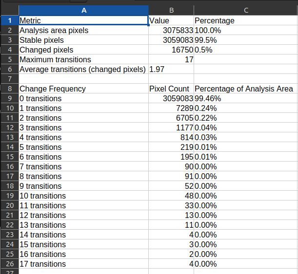

# Land Cover Change Analysis Pipeline

### 2025 - Leandro Meneguelli Biondo - PhD Student IGS/UBCO - Kelowna/BC-Canada
### INMA/MCTI (Santa Teresa/ES-Brazil) - SFB/MMA (Brasilia/DF-Brazil) - [github.com/leandromet/](https://github.com/leandromet/nlp_project_cuda/tree/main/raster_proc/batch_process)
MIT License - Creative Commons Attribution 4.0 International License

A comprehensive Python-based pipeline for analyzing land cover changes over time using satellite imagery data. This tool processes MapBiomas time series data to extract land cover transitions, create visualizations, and generate statistical summaries for specific geographic regions.

## Overview

This pipeline analyzes 40 years of land cover data (1985-2024) from MapBiomas satellite imagery to:

- Extract land cover data for specific polygons/regions
- Calculate pixel-level change frequencies over time
- Generate transition matrices showing land cover class changes
- Create visualizations including maps, Sankey diagrams, and statistical charts
- Produce detailed statistics on land cover persistence and change

## Features

### Core Functionality
- **Polygon-based Analysis**: Process any GeoJSON polygon to extract land cover data
- **Time Series Analysis**: Track changes across 40 years (1985-2024) 
- **Individual Feature Processing**: Handle multiple polygons individually
- **Modular Pipeline**: Skip/include specific processing steps as needed

### Outputs Generated
- **Change Maps**: Visualize frequency of land cover transitions per pixel
- **Land Cover Maps**: Current and historical land cover visualizations
- **Sankey Diagrams**: Interactive flow diagrams showing class transitions
- **Transition Matrices**: Detailed pixel counts for all land cover changes
- **Statistical Reports**: CSV files with comprehensive change statistics
- **GIS-Compatible Files**: PNG files with world files (.pngw) for georeferencing

## Installation

### Requirements
- Python 3.8+
- GDAL/OGR libraries
- Sufficient RAM (8GB+ recommended)
- Storage space for output files

### Dependencies
```bash
pip install -r requirements.txt
```

Key packages:
- `rasterio` - Raster data processing
- `geopandas` - Geospatial vector operations
- `zarr` - Efficient array storage
- `matplotlib` - Visualization
- `plotly` - Interactive charts
- `numpy` - Numerical operations
- `psutil` - Memory monitoring

## Usage

### Command Line Interface

#### Basic Usage
```bash
python main.py --geojson polygons.geojson --vrt mapbiomas_data.vrt --output-dir ./results
```

#### Complete Parameter List
```bash
python main.py \
  --geojson <path_to_geojson_file> \
  --vrt <path_to_vrt_file> \
  --output-dir <output_directory> \
  [--skip-extraction] \
  [--skip-visualization] \
  [--skip-sankey] \
  [--skip-transition-viz] \
  [--verbose]
```

#### Parameters

| Parameter | Required | Description |
|-----------|----------|-------------|
| `--geojson` | Yes | Path to GeoJSON file containing analysis polygons |
| `--vrt` | Yes | Path to VRT file with MapBiomas time series data |
| `--output-dir` | Yes | Directory where results will be saved |
| `--skip-extraction` | No | Skip data extraction, use existing Zarr files |
| `--skip-visualization` | No | Skip map and chart generation |
| `--skip-sankey` | No | Skip Sankey diagram creation |
| `--skip-transition-viz` | No | Skip transition visualization creation |
| `--verbose` | No | Enable detailed logging output |

### Programmatic Usage

```python
from main import run_batch_processing

success = run_batch_processing(
    geojson_path="analysis_areas.geojson",
    vrt_path="/path/to/mapbiomas.vrt", 
    output_dir="./results",
    verbose=True
)
```

## Input Data Requirements

### GeoJSON File
- **Format**: Standard GeoJSON with polygon geometries
- **Coordinate System**: WGS84 (EPSG:4326)
- **Features**: Single or multiple polygons supported
- **Properties**: Optional attributes will be preserved

  

Example structure:
```json
{
  "type": "FeatureCollection",
  "features": [
    {
      "type": "Feature",
      "properties": {
        "name": "Study Area 1"
      },
      "geometry": {
        "type": "Polygon",
        "coordinates": [[[-50.0, -10.0], [-49.0, -10.0], [-49.0, -9.0], [-50.0, -9.0], [-50.0, -10.0]]]
      }
    }
  ]
}
```

### VRT File (Virtual Raster)


- **Format**: GDAL VRT pointing to MapBiomas time series
- **Bands**: 40 bands (1985-2024, one per year)
- **Projection**: Geographic coordinates (EPSG:4326)
- **No-data values**: Properly defined for water/outside areas


## Output Structure

### File Organization
```
output_directory/
├── polygon_name_data.zarr/           # Raw extracted data
├── polygon_name_changes_map.png      # Change frequency map
├── polygon_name_landcover_map.png    # Current land cover
├── polygon_name_initial_landcover_map.png  # 1985 land cover
├── polygon_name_sankey_diagram.html  # Interactive flow diagram
├── polygon_name_transition_matrix.csv # Complete transition data
├── polygon_name_change_statistics.csv # Summary statistics
└── polygon_name_*.pngw              # World files for GIS
```

### Zarr Data Structure
Efficient compressed arrays containing:
- `changes`: Pixel-level change frequency (0-N transitions)
- `first_year`: Land cover classes in 1985
- `last_year`: Land cover classes in 2024
- `transition_matrix`: Class-to-class transition counts
- `persistence_counts`: Pixels that never changed per class
- `initial_counts`: Starting pixel counts per class


## Understanding the Analysis

### Land Cover Change Detection
The pipeline tracks changes by:

1. **Reading time series**: All 40 years of MapBiomas data per pixel
2. **Detecting transitions**: Comparing year-to-year land cover classes
3. **Counting changes**: Accumulating total transitions per pixel
4. **Excluding no-data**: Masking water bodies and areas outside Brazil


### Change Frequency Scale
- **0 transitions**: Stable pixels (same class for 40 years)
- **1-3 transitions**: Low change frequency (typical for protected areas)
- **4-10 transitions**: Moderate change (agricultural rotation, regeneration)
- **11+ transitions**: High change (intense land use dynamics)

### Statistical Outputs

#### Change Statistics CSV
- **Analysis area pixels**: Total pixels within polygon
- **Stable pixels**: Pixels with 0 transitions (%)
- **Changed pixels**: Pixels with 1+ transitions (%)
- **Maximum transitions**: Highest change frequency observed
- **Change frequency distribution**: Histogram of transition counts




#### Transition Matrix CSV  
- **From/To classes**: Land cover transitions between all classes
- **Pixel counts**: Number of pixels for each transition type
- **Temporal aggregation**: Summed across all 40 years


## Visualization Guide

### Change Maps
- **Color scale**: Purple (low) to yellow (high) change frequency
- **Masked areas**: Gray for outside polygon, white for no-data
- **Red outline**: Polygon boundary overlay
- **Statistics box**: Key metrics displayed on map


### Sankey Diagrams
- **Flow width**: Proportional to number of pixels transitioning
- **Color coding**: Follows MapBiomas class colors
- **Interactive**: Hover for details, click to highlight flows
- **Aggregated**: Shows net transitions between classes


### Land Cover Maps
- **MapBiomas colors**: Standard color scheme for land cover classes
- **Legend**: Class codes and descriptions
- **Georeferenced**: Includes .pngw files for GIS import


### Other Visualization products - Charts


## Performance Considerations

### Memory Requirements
- **Small polygons** (<1000 km²): 4-8 GB RAM
- **Medium polygons** (1000-5000 km²): 8-16 GB RAM  
- **Large polygons** (>5000 km²): 16+ GB RAM

### Processing Time
- **Data extraction**: 1-10 minutes per polygon (depends on size)
- **Visualizations**: 30 seconds - 2 minutes per polygon
- **Sankey diagrams**: 10-30 seconds per polygon

### Optimization Tips
- Use `--skip-extraction` to regenerate only visualizations if ZARR already available
- Process large regions in smaller chunks
- Ensure sufficient disk space (1-5 GB per large polygon)
- Monitor memory usage with `--verbose` flag

## Configuration

### Color Maps and Labels
Edit `config.py` to customize:
- Land cover class colors
- Class label descriptions  
- Processing parameters
- File paths and defaults

### Processing Parameters
Key configurable values:
- `PROCESSING_TILE_SIZE`: Memory vs. speed trade-off
- `MAX_WORKERS`: Parallel processing threads
- `FILL_VALUE`: No-data value handling

## Troubleshooting

### Common Issues

#### Memory Errors
```
RuntimeError: out of memory
```
**Solutions:**
- Reduce `PROCESSING_TILE_SIZE` in config.py
- Decrease `MAX_WORKERS`
- Process smaller polygons
- Add more RAM or swap space

#### Projection Mismatches
```
Warning: CRS mismatch between data sources
```
**Solutions:**
- Ensure GeoJSON is in WGS84 (EPSG:4326) or SIRGAS 2000 South America - EPSG:4674
- Verify VRT coordinate system
- Check polygon bounds are within Brazil

#### Missing Dependencies
```
ImportError: No module named 'rasterio'
```
**Solutions:**
- Install GDAL system libraries first
- Use conda for complex geospatial dependencies
- Check virtual environment activation

#### Empty Results
```
No valid analysis area found!
```
**Solutions:**
- Verify polygon intersects with MapBiomas data extent
- Check for very small polygons (<1 pixel)
- Ensure polygon coordinates are valid

### Debug Mode
Enable detailed logging:
```bash
python main.py --verbose [other parameters]
```

## Scientific Applications

### Use Cases
- **Deforestation monitoring**: Track forest loss in protected areas
- **Agricultural expansion**: Analyze cropland change patterns
- **Urban growth**: Monitor city expansion over time
- **Restoration assessment**: Evaluate reforestation success
- **Policy impact**: Before/after analysis of interventions

### Data Quality Considerations
- **MapBiomas accuracy**: ~85% overall classification accuracy
- **Temporal consistency**: Some year-to-year noise expected
- **Spatial resolution**: 30m pixels (0.09 hectares)
- **Class definitions**: Follow MapBiomas collection methodology

## Citation

When using this software, please cite:
- MapBiomas Project for the underlying land cover data
- This analysis pipeline (provide repository DOI if applicable)

## Support

For questions and issues:
1. Check this documentation
2. Review log files with `--verbose` flag
3. Ensure input data meets requirements
4. Open an issue in the project repository

## License

[Specify your license here]

---

**Version**: 1.0  
**Last Updated**: August 2025  
**Compatible with**: MapBiomas Collection 8.0+
